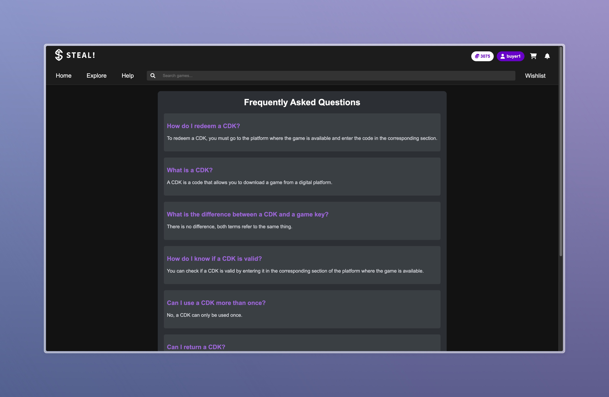
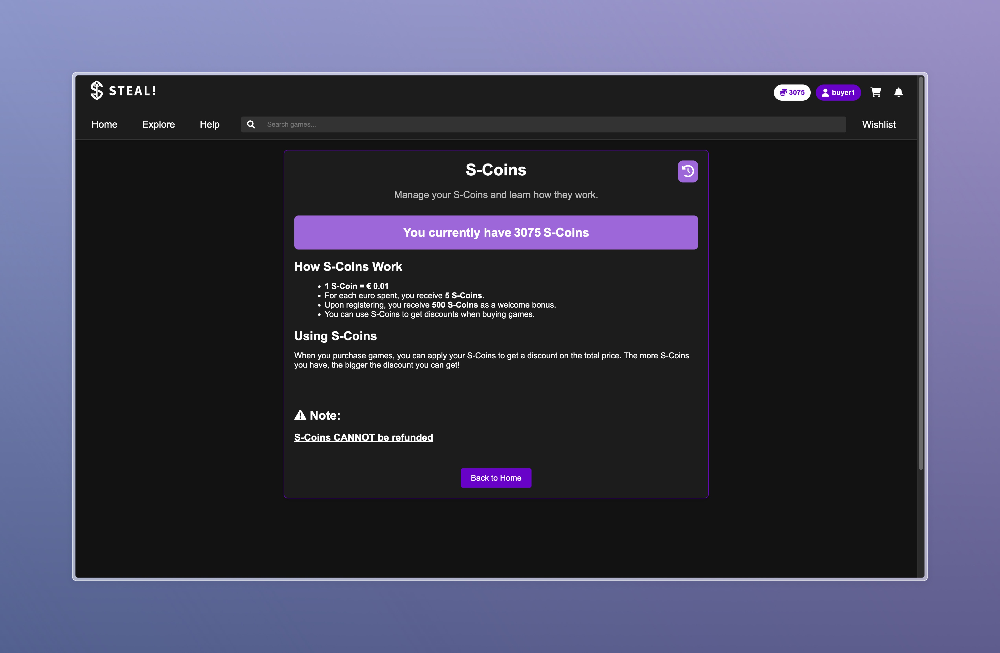
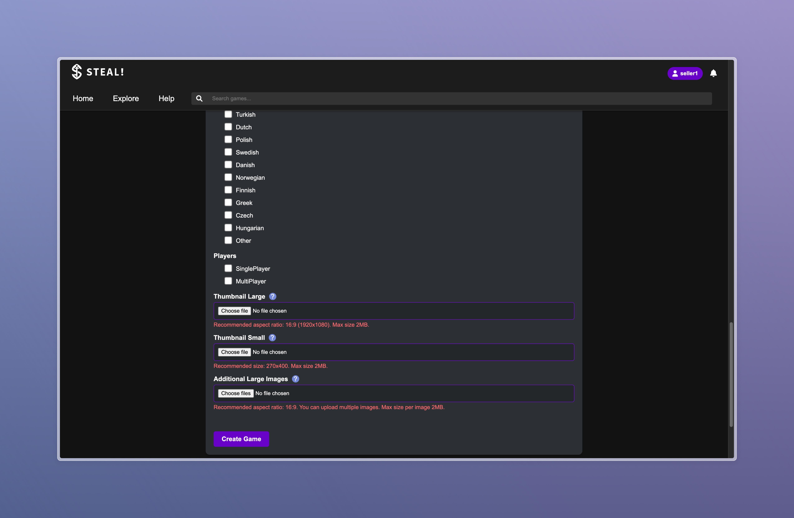
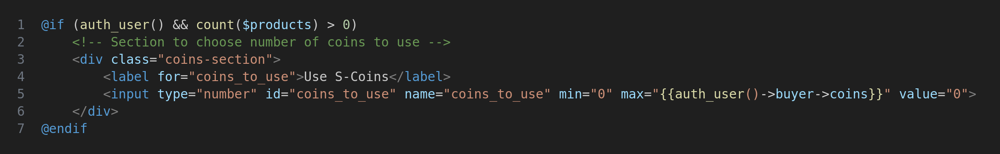
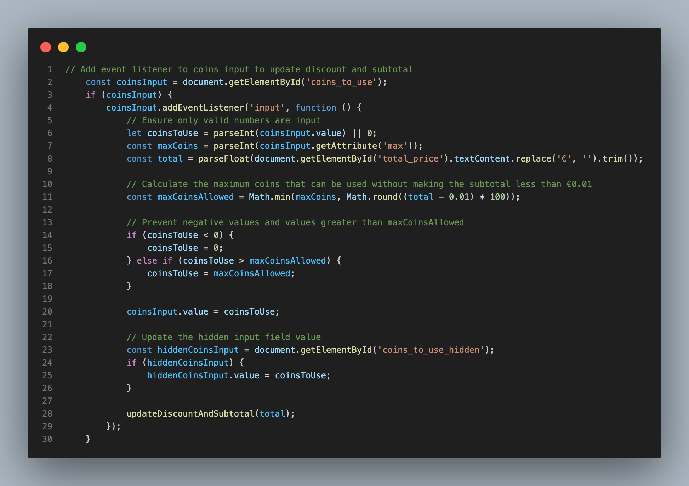
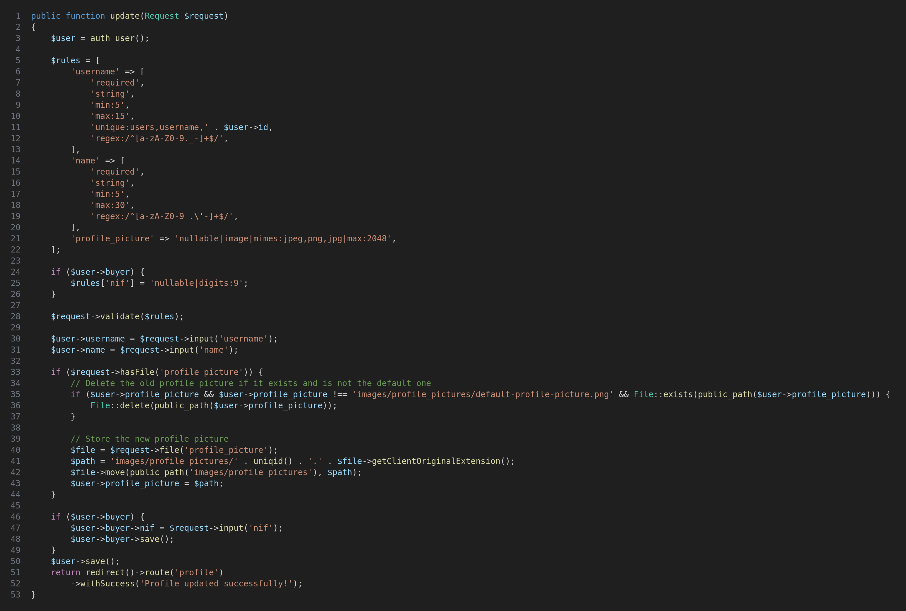

# PA: Product and Presentation

**Project Vision**

**STEAL!** is an online marketplace focused on selling Content Distribution Keys (CDKs). It offers a secure, user-friendly platform for gamers seeking affordable game keys, aiming to become the top destination for accessible, high-quality digital gaming.

> **"SO AFFORDABLE IT'S LIKE STEALING!"** 

## A9: Product

We developed **STEAL!**, an innovative online platform designed to revolutionize the purchase of game CDKs (Content Distribution Keys). Our goal was to create an affordable, user-friendly marketplace that competes with industry giants like Steam, Uplay, and Origin.

### Key Features:
1. **Game Recommendations:** The system suggests games basesd on user’s past orders, and also the top-seller games, enhancing discovery based on interests.
    
2. **Filters and Search:** Users can easily find games with advanced filtering by category, platform, language, player modes and price, alongside a robust full-text search feature.

3. **Wishlist and Notifications:** Users are notified in real time when their wishlisted items go on sale or are restocked.

4. **Personalized Profiles:** Customizable user profiles allow users to tailor their experience, complete with profile pictures and purchase histories.

5. **Reward System:** Buyers earn S coins as cashback from purchases, which can be used for discounts on future purchases.

6. **Checkout Options:** Buyers can purchase a single game or an entire shopping cart, supporting multiple payment methods.

7. **Account Management:** Administrators can manage user activity by blocking/unblocking or deleting accounts for security and compliance. They also oversee games, categories, and other metadata to ensure accurate listings and a high-quality user experience.

### 1. Installation

To start the Docker image available at the group's GitLab Container Registry using the production database, use the following command:

```bash
docker run -d --name lbaw2435 -p 8001:80 gitlab.up.pt:5050/lbaw/lbaw2425/lbaw2435
```
For ARM users (e.g., Apple Silicon Macs) you can run the image with:

```bash
docker run --platform linux/arm64 -d --name lbaw2435 -p 8001:80 gitlab.up.pt:5050/lbaw/lbaw2425/lbaw2435
```

The application will be available at `http://localhost:8001`

### 2. Usage

#### 2.1. Administration Credentials

> Administration URL: http://localhost:8001/profile

| Username | Email | Password |
| -------- | -------- | -------- |
| admin    | admin@example.com | 1234

#### 2.2. User Credentials

| Type | Username | Email | Password |
| -------- | --------- | -------- | -------- |
| Buyer Account | buyer1 | buyer1@example.com | 1234 |
| Seller Account | seller1 | seller1@example.com | 1234 |

#### 2.3. Mailtrap Credentials

| Gmail | Password |
| - | - |
| lbaw2435steal@gmail.com | steal12345 |

### 3. Application Help

> We primarily provide assistance through error messages when users encounter issues, but we have also implemented some static pages to help users in some specific problems, like FAQs or about our feature S-Coins.




> We also have info icons to help users know what needs to be done in specific sections. Users can check by hovering the cursor over the icons



### 4. Input Validation

> We ensure robust data validation by implementing both client-side and server-side validation techniques. Additionally, we use JavaScript to restrict input in specific cases.

#### Validate S-Coins input before shopping cart checkout




#### Validate attributes before updating profile




**Note:** For profile pictures or game media, we ensure proper image substitution by deleting the old image when updating with a new one. Additionally, if an image is deleted directly from the database (in this project's case,  from the file system), our system checks if the file exists. If the file is missing, it will automatically use the path of the default image for display.

### 5. Check Accessibility and Usability

> Accessibility: 16/18 ([view accessibility test](artifacts/accessibility_usability/Accessibility.pdf))

We didn't specifically use &lt;fieldset&gt; nor &lt;legend&gt; but we think we have organized the forms in a easy-to-understand manner.

Some forms errors are not displayed near the inputs/labels to maintain a minimalist and clean appearance.

> Usability: 23/28 ([view usability test](artifacts/accessibility_usability/Usability.pdf))

We had to define some fixed height and width for images to ensure consistent layout and presentation across different sections of the application.

We also didn't try to optimize the contents for mobile, as our project focused mainly in web part.

### 6. HTML & CSS Validation

> HTML: [Game Details Page Report](artifacts/html_css/game-details-html.pdf) ([view file here](resources/views/pages/game-details.blade.php))

> CSS: [Game Details Page CSS Report](artifacts/html_css/game-details-css.pdf) ([view file here](public/css/game_details.css))

### 7. Revisions to the Project

> We made some changes to the database and relationships to improve functionality and performance. However, overall, the project followed our initial specifications and objectives closely, ensuring that the core features and design principles were maintained.

### 8. Implementation Details

#### 8.1. Libraries Used

> This section includes references to all the libraries and frameworks used in the product, along with their descriptions and links to examples where they are used.

- **Laravel**
    - **Reference:** [Laravel](https://laravel.com/)
    - **Description:** Laravel is a PHP framework used for building web applications with an elegant syntax. It provides tools for routing, authentication, sessions, and caching.
    - **Example:** Used throughout the application for routing, database interactions, and authentication. See [routes/web.php](routes/web.php) for routing examples.

- **Font Awesome**
    - **Reference:** [Font Awesome](https://fontawesome.com/)
    - **Description:** Font Awesome is a library of icons and social logos that can be easily integrated into web projects.
    - **Example:** Used for icons in the user interface. See [resources/views/layouts/app.blade.php](resources/views/layouts/app.blade.php) for examples of icon usage.

- **Mailtrap**
    - **Reference:** [Mailtrap](https://mailtrap.io/)
    - **Description:** Mailtrap is a tool for safe email testing in staging and development environments. It captures emails sent from the application and provides a web interface to view them.
    - **Example:** Used for testing email functionality. See [config/mail.php](config/mail.php) for Mailtrap configuration.

- **Google OAuth**
    - **Reference:** [Google OAuth](https://developers.google.com/identity/protocols/oauth2)
    - **Description:** Google OAuth allows users to authenticate with their Google account, providing a secure and convenient way to log in to the application without needing to create a separate account.
    - **Example:** Used for another type of login and third-party authentication. See [config/services.php](config/services.php) for Google OAuth configuration.

#### 8.2 User Stories

| US Identifier | Name | Module | Priority | Team Members | State |
| - | - | - | - | - | - |
| US01 | Browse Marketplace | Anonymous User | High | **Ricardo Yang**, Bruno Huang | 100% |
| US02 | View Product Details | Anonymous User | High | **Ricardo Yang**, Bruno Huang, Daniel Basílio | 100% | 
| US03 | Register Account | Anonymous User | High | **Bruno Huang** | 100% | 
| US04 | Sign In Account | Anonymous User | High | **Bruno Huang** | 100% |
| US05 | Add to Shopping Cart | Anonymous User | High | **Daniel Basílio** | 100% |
| US06 | Manage Shopping Cart | Anonymous User | High | **Daniel Basílio** | 100% |
| US07 | Full Text Search | Anonymous User | High | **Ricardo Yang** | 100% |
| US08 | Search Games by Genre/Platform | Anonymous User | High | **Ricardo Yang**, Bruno Huang | 100% |
| US09 | Access Static Pages | Anonymous User | Medium | **Ricardo Yang** | 100% |
| US10 | Delete Own Account | Authenticated User | High | **Bruno Huang** | 100% |
| US11 | Edit Profile | Authenticated User | High | **Bruno Huang** | 100% |
| US12 | Log Out | Authenticated User | High | **Bruno Huang** | 100% |
| US13 | View Profile | Authenticated User | High | **Bruno Huang** | 100% |
| US14 | Update Profile Information | Authenticated User | High | **Bruno Huang** | 100% |
| US15 | Change Password | Authenticated User | Medium | **Bruno Huang** | 100% |
| NEW | Recover Password | Authenticated User | Medium | **Bruno Huang** | 100% |
| US16 | Contact Customer Support | Authenticated User | Low | **Ricardo Yang** | 50% |
| US17 | View Activity History | Authenticated User | Low | - | 0% |
| US18 | Checkout Items | Buyer | High | **Francisco Magalhães**, Bruno Huang  | 100% |
| US19 | Manage Wishlist | Buyer | High | **Daniel Basílio** | 100% |
| US20 | Add to Wishlist | Buyer | High | **Daniel Basílio** | 100% |
| US21 | Leave Reviews and Ratings | Buyer | Medium | **Daniel Basílio**, Bruno Huang, Ricardo Yang | 100% |
| US22 | Track Purchase History | Buyer | Medium | **Francisco Magalhães** | 100% |
| US23 | Receive Payment and Order Notifications | Buyer | Medium | **Francisco Magalhães** | 100% |
| US24 | Review Purchased Product | Buyer | Medium | **Daniel Basílio** | 100% |
| US25 | Edit or Remove Review | Buyer | Medium | **Daniel Basílio** | 100% |
| US26 | Cancel Order | Buyer | Medium | **Francisco Magalhães** | 100% |
| US27 | Report Inappropriate Reviews | Buyer | Medium | **Daniel Basílio**, Bruno Huang | 100% |
| US28 | Receive Price Notifications | Buyer | Medium | **Francisco Magalhães** | 100% |
| US29 | Multiple Payment Options | Buyer | Low | **Francisco Magalhães** | 100% |
| US30 | Pay With S Coins | Buyer | Low | **Bruno Huang** | 100% |
| US31 | Receive Game Recommendations | Buyer | Low | **Bruno Huang** | 50% |
| US32 | List Games for Sale | Seller | High | **Ricardo Yang** | 100% |
| US33 | Manage Product Listings | Seller | High | **Ricardo Yang** | 100% |
| US34 | Manage Product Information and Pricing | Seller | Medium | **Ricardo Yang** | 100% |
| US35 | View Sales History | Seller | Medium | **Ricardo Yang** | 100% |
| US36 | Receive Seller Notifications | Seller | Medium | **Francisco Magalhães** | 100% |
| US37 | Oversee Order Processing | Seller | Medium | **Francisco Magalhães** | 100% |
| US38 | Manage Product Discounts | Seller | Low | **Ricardo Yang** | 50% |
| US39 | Administer User Accounts (Search, View, Edit, Create) | Administrator | High | **Bruno Huang** | 100% |
| NEW | Manage Game Fields | Administrator | High | **Bruno Huang** | 100% |
| US40 | Block/Unblock or Delete User Accounts | Administrator | Medium | **Bruno Huang** | 100% |
| US41 | Remove or Suspend Products | Administrator | Medium | **Bruno Huang** | 100% |
| US42 | Delete inappropriate reviews | Administrator | Medium | **Bruno Huang** | 100% |
| US43 | Send Notification | Administrator | Low | - | 0% |
| US44 | Access to Sales Report | Administrator | Low | **Ricardo Yang** | 100% |


---


## A10: Presentation

### 1. Product presentation

STEAL! is an innovative online marketplace designed to revolutionize the purchase of game Content Distribution Keys (CDKs). Our platform offers a secure, user-friendly environment for gamers seeking affordable game keys. With a focus on affordability and ease of use, STEAL! aims to become the top destination for accessible, high-quality digital gaming.

The platform features advanced game recommendations based on user preferences, robust search and filtering options, real-time notifications for wishlisted items, and personalized user profiles. Additionally, STEAL! includes a reward system where buyers earn S coins as cashback, multiple checkout options, and comprehensive account management tools for administrators to ensure a high-quality user experience.

### 2. Video presentation

> Screenshot of the video plus the link to the lbawYYgg.mp4 file.
> - Upload the lbawYYgg.mp4 file to Moodle.
> - The video must not exceed 2 minutes.


---


## Revision history

Changes made to the first submission:
1. Item 1
1. ..

***
GROUP2435, 21/12/2024

* Bruno Huang, up202207517@up.pt (Editor)
* Daniel Basílio, up201806838@up.pt
* Francisco Magalhães, up202007945@up.pt
* Ricardo Yang, up202208465@up.pt