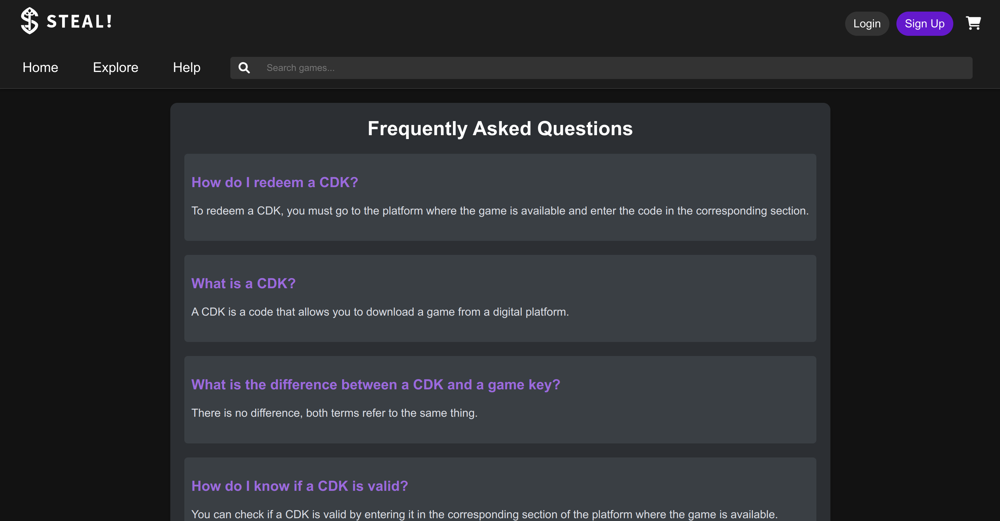
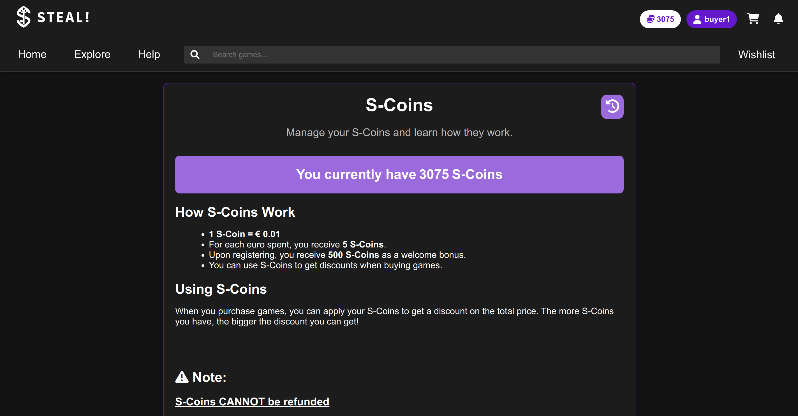
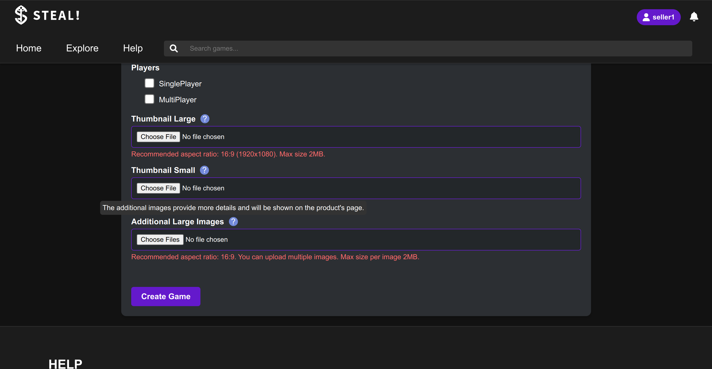

# PA: Product and Presentation

**Project Vision**

**STEAL!** is an online marketplace focused on selling Content Distribution Keys (CDKs). It offers a secure, user-friendly platform for gamers seeking affordable game keys, aiming to become the top destination for accessible, high-quality digital gaming.

> **"SO AFFORDABLE IT'S LIKE STEALING!"** 

## A9: Product

We developed **STEAL!**, an innovative online platform designed to revolutionize the purchase of game CDKs (Content Distribution Keys). Our goal was to create an affordable, user-friendly marketplace that competes with industry giants like Steam, Uplay, and Origin.

### Key Features:
1. **Game Recommendations:** The system suggests games basesd on user’s past orders, and also the top-seller games, enhancing discovery based on interests.
    
2. **Filters and Search:** Users can easily find games with advanced filtering by category, platform, language, player modes and price, alongside a robust full-text search feature.

3. **Wishlist and Notifications:** Users are notified in real time when their wishlisted items go on sale or are restocked.

4. **Personalized Profiles:** Customizable user profiles allow users to tailor their experience, complete with profile pictures and purchase histories.

5. **Reward System:** Buyers earn S coins as cashback from purchases, which can be used for discounts on future purchases.

6. **Checkout Options:** Buyers can purchase a single game or an entire shopping cart, supporting multiple payment methods.

7. **Account Management:** Administrators can manage user activity by blocking/unblocking or deleting accounts for security and compliance. They also oversee games, categories, and other metadata to ensure accurate listings and a high-quality user experience.

### 1. Installation

> Link to the release with the final version of the source code in the group's Git repository.  

To start the Docker image available at the group's GitLab Container Registry using the production database, use the following command:

```bash
docker run -d --name lbaw2435 -p 8001:80 gitlab.up.pt:5050/lbaw/lbaw2425/lbaw2435
```

For **ARM** users (e.g., Apple Silicon Macs), Docker Desktop supports architecture emulation using `qemu`. You can run the image with:

```bash
docker run --platform linux/amd64 -d --name lbaw2435 -p 8001:80 gitlab.up.pt:5050/lbaw/lbaw2425/lbaw2435
```

The application will be available at `http://localhost:8001`

### 2. Usage

#### 2.1. Administration Credentials

> Administration URL: http://localhost:8001/profile

| Username | Email | Password |
| -------- | -------- | -------- |
| admin    | admin@example.com | 1234

#### 2.2. User Credentials

| Type | Username | Email | Password |
| -------- | --------- | -------- | -------- |
| Buyer Account | buyer1 | buyer1@example.com | 1234 |
| Seller Account | seller1 | seller1@example.com | 1234 |

### 3. Application Help

> We primarily provide assistance through error messages when users encounter issues, but we have also implemented some static pages to help users in some specific problems, like FAQs or about our feature S-Coins.




> We also have info icons to help users know what needs to be done in specific sections.



### 4. Input Validation

> We ensure robust data validation by implementing both client-side and server-side validation techniques. Additionally, we use JavaScript to restrict input in specific cases.

#### Validate S-Coins input before shopping cart checkout


#### Validate attributes before updating profile


**Note:** For profile pictures or game media, we ensure proper image substitution by deleting the old image when updating with a new one. Additionally, if an image is deleted directly from the database (in this project's case,  from the file system), our system checks if the file exists. If the file is missing, it will automatically use the path of the default image for display.

### 5. Check Accessibility and Usability

> Provide the results of accessibility and usability tests using the following checklists. Include the results as PDF files in the group's repository. Add individual links to those files here.
>
> Accessibility: https://ux.sapo.pt/checklists/acessibilidade/  
> Usability: https://ux.sapo.pt/checklists/usabilidade/  

### 6. HTML & CSS Validation

> Provide HTML and CSS validation results for the central page of your product (e.g., auction page, event page, product page).
> Use the following tools and upload the reports as PDFs to the group’s repository and link them here.
>   
> HTML: https://validator.w3.org/nu/  
> CSS: https://jigsaw.w3.org/css-validator/  

### 7. Revisions to the Project

> List significant revisions made since the initial project specification, highlighting key improvements and fixes.  


### 8. Implementation Details

#### 8.1. Libraries Used

> Include reference to all the libraries and frameworks used in the product.  
> Include library name and reference, description of the use, and link to the example where it's used in the product.  

#### 8.2 User Stories

> This subsection should include all high and medium priority user stories, sorted by order of implementation. Implementation should be sequential according to the order identified below. 
>
> If there are new user stories, also include them in this table. 
> The owner of the user story should have the name in **bold**.
> This table should be updated when a user story is completed and another one started. 

| US Identifier | Name    | Module | Priority                       | Team Members               | State  |
| ------------- | ------- | ------ | ------------------------------ | -------------------------- | ------ |
|  US01          | US Name 1 | Module A | High | **John Silva**, Ana Alice   |  100%  |
|  US02          | US Name 2 | Module A | Medium | **Ana Alice**, John Silva                 |   75%  | 
|  US03          | US Name 3 | Module B | Low | **Francisco Alves**                 |   5%  | 
|  US04          | US Name 4 | Module A | Low | -                 |   0%  | 


---


## A10: Presentation
 
> This artifact corresponds to the presentation of the product.

### 1. Product presentation

> Brief presentation of the product and its main features (2 paragraphs max).  
>
> Groups are expected to present the product using the delivered version.
> No presentation slides are required.

### 2. Video presentation

> Screenshot of the video plus the link to the lbawYYgg.mp4 file.
> - Upload the lbawYYgg.mp4 file to Moodle.
> - The video must not exceed 2 minutes.


---


## Revision history

Changes made to the first submission:
1. Item 1
1. ..

***
GROUPYYgg, DD/MM/20YY

* Group member 1 name, email (Editor)
* Group member 2 name, email
* ...