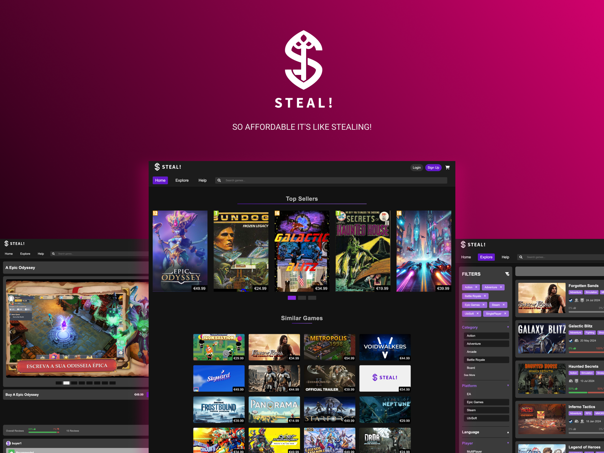

<div align="center">
    
</div>
</br>

**STEAL!** is an online marketplace focused on selling [CD Keys](https://help.steampowered.com/en/faqs/view/0E71-0971-324A-1161). It offers a secure, user-friendly platform for gamers seeking affordable game keys, aiming to become the top destination for accessible, high-quality digital gaming.

## Features
- 🎮 **Personalized Recommendations**: Suggests games based on past orders and top-sellers
- 🔍 **Advanced Search**: Easily find games with filters
- 🔔 **Wishlist Alerts**: Real-time notifications for sales and restocks
- 🎁 **Rewards**: Earn S-coins for discounts on future purchases.
- 💰 **Flexible Checkout**: Buy single games or entire carts with multiple payment options.


## Installation
To prepare for development, you need to install:
- [PHP](https://www.php.net/) version 8.3 or higher
- [Composer](https://getcomposer.org/) version 2.2 or higher

```bash
sudo apt update
sudo apt install git composer php8.3 php8.3-mbstring php8.3-xml php8.3-pgsql php8.3-curl
```

On macOS, install using [Homebrew](https://brew.sh/):
```bash
brew install php@8.3 composer
```

## Quickstart

### PostgreSQL setup
The Docker Compose file provided sets up **PostgreSQL** and **pgAdmin4** as local Docker containers.

To **start the container**, from the project root run the following command:
```bash
docker compose up -d
```
Open your browser and navigate to [http://localhost:4321](localhost:4321) to access pgAdmin4.


In pgAdmin4, **Add New Server**:
- **Name:** postgres
- **Host name/address:** postgres
- **Port:** 5432
- **Maintenance database:** postgres
- **Username:** postgres
- **Password:** pg!password


To **stop the container**, just run the command:
```bash
docker compose down
```


### Environment setup
To setup the env variables, run the command:
```bash
cp .env.example .env
```
To use all the functionalities of the website, ensure you fill in `.env` the [variables](docs/env-config.md).

### PHP setup
Install all local dependencies required for development:
```bash
composer install
```

### To start the development
```bash
# Seed database from the SQL file
php artisan db:seed

# Start the development server
php artisan serve
```

Access to [localhost:8000](localhost:8000).


> [!IMPORTANT]  
> You might need to **GENERATE APP KEY** to be able to use the application.

Run the following command if necessary:
```bash
php artisan key:generate
```

## Login credentials
| Username | Email | Password |
| - | - | - |
| admin | admin@example.com | 1234 |
| buyer1 | buyer1@example.com | 1234 |
| seller1 | seller1@example.com | 1234 |

## Demo
[](https://www.youtube.com/watch?v=bTJrHXjnlQc)


## Contributors

* Bruno Huang (202207517)
* Daniel Basílio (201806838)
* Francisco Magalhães (202007945)
* Ricardo Yang (202208465)


This project was developed for [LBAW](https://sigarra.up.pt/feup/en/UCURR_GERAL.FICHA_UC_VIEW?pv_ocorrencia_id=541888) course unit at FEUP.