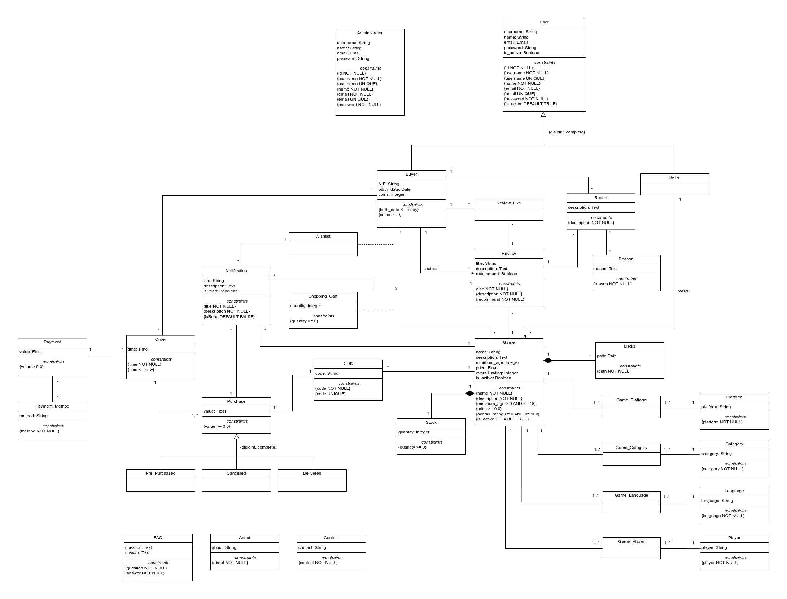

# EBD: Database Specification Component

**Project Vision**

**STEAL!** is an online marketplace focused on selling Content Distribution Keys (CDKs). It offers a secure, user-friendly platform for gamers seeking affordable game keys, aiming to become the top destination for accessible, high-quality digital gaming.

> **"SO AFFORDABLE IT'S LIKE STEALING!"** 

----

## A4: Conceptual Data Model

The goal of the class diagram for STEAL! is to visually represent the core components and structure of the platform, defining the key entities, attributes, and behaviors necessary to manage the buying, selling, and distribution of game CDKs.

### 1. Class diagram

> The following artifact is a UML class diagram representing the conceptual model of the STEAL! platform.



**Figure 1:** STEAL! conceptual data model in UML.

### 2. Additional Business Rules
 
- BR01 - A seller is unable to purchase games on the platform.
- BR02 - A buyer is unable to purchase games that have a higher age rating than their own.
- BR03 - A buyer may only like a particular review once. Each combination of a buyer and a review must be unique within the review like system.

---


## A5: Relational Schema, validation and schema refinement

> This artifact outlines the STEAL! platform's relational schema, detailing key relations, attributes, data types, and integrity constraints to ensure data consistency and accuracy in the database design.

### 1. Relational Schema

> The Relational Schema specifies the relations, attributes, domains, and integrity constraints like UNIQUE, DEFAULT, NOT NULL, and CHECK. Each relation is represented in a compact notation for easy reference. 

| Relation reference | Relation Compact Notation                        |
| ------------------ | ------------------------------------------------ |
| R01                | administrator(<ins>id</ins>, username **UK** **NN**, name **NN**, email **UK** **NN**, password **NN**) |
| R02                | user(<ins>id</ins>, username **UK** **NN**, name **NN**, email **UK** **NN**, password **NN**, is_active **NN** **DF** TRUE) |
| R03                | buyer(<ins>id_user</ins> -> user **NN**, NIF, birth_date **NN** **CK** birth_date <= Today, coins **NN** **CK** coins >= 0) |
| R04                | seller(<ins>id_user</ins> -> user **NN**) |
| R05                | wishlist(<ins>id</ins>, <ins>id_buyer</ins> → buyer **NN**, id_game -> game) |
| R06                | shopping_cart(<ins>id</ins>, <ins>id_buyer</ins> → buyer **NN**, id_game -> game , quantity **NN** **CK** quantity >= 0) |
| R07                | order(<ins>id</ins>, <ins>id_buyer</ins> -> buyer **NN**, <ins>id_payment</ins> -> payment **NN**, time **NN** **CK** time <= Now **DF** Now) |
| R08                | payment(<ins>id</ins>, <ins>id_method</ins> -> payment_method **NN**, value **NN** **CK** value > 0.0) |
| R09                | payment_method(<ins>id</ins>, method **NN**) |
| R10                | notification_wishlist(<ins>id</ins>, id_wishlist -> wishlist **NN**, title **NN**, description **NN**, time **NN** **CK** time <= Now **DF** Now, isRead **NN** **DF** FALSE) |
| R11                | notification_game(<ins>id</ins>, id_game -> game **NN**, title **NN**, description **NN**, time **NN** **CK** time <= Now **DF** Now, isRead **NN** **DF** FALSE) |
| R12                | notification_purchase(<ins>id</ins>, id_purchase -> purchase **NN**, title **NN**, description **NN**, time **NN** **CK** time <= Now **DF** Now, isRead **NN** **DF** FALSE) |
| R13                | notification_review(<ins>id</ins>, id_review -> review **NN**, title **NN**, description **NN**, time **NN** **CK** time <= Now **DF** Now, isRead **NN** **DF** FALSE) |
| R14                | review(<ins>id</ins>, title **NN**, description **NN**, recommend **NN**, id_author -> buyer **NN**, id_game -> game**NN**) |
| R15                | review_like(<ins>id</ins>, id_review -> review **NN**, id_author -> buyer **NN**, (id_review, id_author) **UK**) |
| R16                | report(<ins>id</ins>, description **NN**, id_buyer -> buyer **NN**, id_reason -> reason **NN**, id_review -> review **NN**) |
| R17                | reason(<ins>id</ins>, reason **NN**) |
| R18                | game(<ins>id</ins>, name **NN**, description **NN**, minimum_age **NN** **CK** minimum_age > 0 AND minimum_age <= 18, price **NN** **CK** price > 0.0, overall_rating **NN** **CK** overall_rating >= 0 AND overall_rating <= 100, is_active **NN** **DF** TRUE, id_owner -> seller **NN**) |
| R19                | game_platform(<ins>id</ins>, id_game -> game **NN**, id_platform -> platform **NN**, (id_game, id_platform) **UK**) |
| R20                | game_category(<ins>id</ins>, id_game -> game **NN**, id_category -> category **NN**, (id_game, id_category) **UK**) |
| R21                | game_language(<ins>id</ins>, id_game -> game **NN**, id_language -> language **NN**, (id_game, id_language) **UK**) |
| R22                | game_player(<ins>id</ins>, id_game -> game **NN**, id_player -> player **NN**, (id_game, id_player) **UK**) |
| R23                | cdk(<ins>id</ins>, code **UK** **NN**, id_game -> game **NN**) |
| R24                | stock(<ins>id</ins>, quantity **NN** **CK** quantity >= 0, <ins>id_game</ins> -> game **NN**) |
| R25                | platform(<ins>id</ins>, platform **NN**) |
| R26                | category(<ins>id</ins>, category **NN**) |
| R27                | language(<ins>id</ins>, language **NN**) |
| R28                | player(<ins>id</ins>, player **NN**) |
| R29                | media(<ins>id</ins>, path **NN**, id_game -> game **NN**) |
| R30                | purchase(<ins>id</ins>, value **NN** **CK** value >= 0.0, id_order -> order **NN**, coins **NN** **CK** coins >= 0) |
| R31                | pre_purchase(<ins>id_purchase</ins> -> purchase **NN**, id_game -> game **NN**) |
| R32                | canceled_purchase(<ins>id_purchase</ins> -> purchase **NN**, id_game -> game **NN**) |
| R33                | delivered_purchase(<ins>id_purchase</ins> -> purchase **NN**, id_cdk -> cdk **UK** **NN**) |
| R34                | faq(<ins>id</ins>, question **NN**, answer **NN**) |
| R35                | about(<ins>id</ins>, about **NN**) |
| R36                | contact(<ins>id</ins>, contact **NN**) |

Legend: 
- UK = UNIQUE KEY
- NN = NOT NULL
- CK = CHECK
- DF = DEFAULT

### 2. Domains

> Specification of additional domains:  

| Domain Name | Domain Specification           |
| ----------- | ------------------------------ |
| Today	      | DATE DEFAULT CURRENT_DATE      |
| Now         | TIMESTAMP DEFAULT CURRENT_TIMESTAMP |

### 3. Schema validation

| **TABLE R01** | administrator |
| - | - |
| **Keys** | { id }, { username }, { email } |
| **Functional Dependencies:** | |
| FD0101 | id → {username, name, email, password} |
| FD0102 | username → {id, name, email, password} |
| FD0103 | email → {id, username, name, password} |
| **NORMAL FORM** | BCNF |

| **TABLE R02** | user |
| - | - |
| **Keys** | { id }, { username }, { email } |
| **Functional Dependencies:** | |
| FD0201 | id → {username, name, email, password, is_active} |
| FD0202 | username → {id, name, email, password, is_active} |
| FD0203 | email → {id, username, name, password, is_active} |
| **NORMAL FORM** | BCNF |

| **TABLE R03** | buyer |
| - | - |
| **Keys** | { id_user } |
| **Functional Dependencies:** | |
| FD0301 | id_user → {NIF, birth_date, coins} |
| **NORMAL FORM** | BCNF |

| **TABLE R04** | seller |
| - | - |
| **Keys** | { id_user } |
| **Functional Dependencies:** | *none* |
| **NORMAL FORM** | BCNF |

| **TABLE R05** | wishlist |
| - | - |
| **Keys** | { id }, { id_buyer, id_game } |
| **Functional Dependencies:** | |
| FD0501 | id → {id_buyer, id_game} |
| FD0502 | { id_buyer, id_game } → {id} |
| **NORMAL FORM** | BCNF |

| **TABLE R06** | shopping_cart |
| - | - |
| **Keys** | { id }, { id_buyer, id_game } |
| **Functional Dependencies:** | |
| FD0601 | id → {id_buyer, id_game, quantity} |
| FD0602 | { id_buyer, id_game } → {id, quantity} |
| **NORMAL FORM** | BCNF |

| **TABLE R07** | order |
| - | - |
| **Keys** | { id } |
| **Functional Dependencies:** | |
| FD0701 | id → {id_buyer, id_payment, time} |
| **NORMAL FORM** | BCNF |

| **TABLE R08** | payment |
| - | - |
| **Keys** | { id } |
| **Functional Dependencies:** | |
| FD0801 | id → {id_method, value} |
| **NORMAL FORM** | BCNF |

| **TABLE R09** | payment_method |
| - | - |
| **Keys** | { id } |
| **Functional Dependencies:** | |
| FD0901 | id → {method} |
| **NORMAL FORM** | BCNF |

| **TABLE R10** | notification_wishlist |
| - | - |
| **Keys** | { id } |
| **Functional Dependencies:** | |
| FD1001 | id → {id_wishlist, title, description, time, isRead} |
| **NORMAL FORM** | BCNF |

| **TABLE R11** | notification_game |
| - | - |
| **Keys** | { id } |
| **Functional Dependencies:** | |
| FD1101 | id → {id_game, title, description, time, isRead} |
| **NORMAL FORM** | BCNF |

| **TABLE R12** | notification_purchase |
| - | - |
| **Keys** | { id } |
| **Functional Dependencies:** | |
| FD1201 | id → {id_purchase, title, description, time, isRead} |
| **NORMAL FORM** | BCNF |

| **TABLE R13** | notification_review |
| - | - |
| **Keys** | { id } |
| **Functional Dependencies:** | |
| FD1301 | id → {id_review, title, description, time, isRead} |
| **NORMAL FORM** | BCNF |

| **TABLE R14** | review |
| - | - |
| **Keys** | { id } |
| **Functional Dependencies:** | |
| FD1401 | id → {title, description, recommend, id_author, id_game} |
| **NORMAL FORM** | BCNF |

| **TABLE R15** | review_like |
| - | - |
| **Keys** | { id } |
| **Functional Dependencies:** | |
| FD1501 | id → {id_review, id_author} |
| **NORMAL FORM** | BCNF |

| **TABLE R16** | report |
| - | - |
| **Keys** | { id } |
| **Functional Dependencies:** | |
| FD1601 | id → {description, id_buyer, id_reason, id_review} |
| **NORMAL FORM** | BCNF |

| **TABLE R17** | reason |
| - | - |
| **Keys** | { id } |
| **Functional Dependencies:** | |
| FD1701 | id → {reason} |
| **NORMAL FORM** | BCNF |

| **TABLE R18** | game |
| - | - |
| **Keys** | { id } |
| **Functional Dependencies:** | |
| FD1801 | id → {name, description, minimum_age, price, overall_rating, is_active, id_owner} |
| **NORMAL FORM** | BCNF |

| **TABLE R19** | game_platform |
| - | - |
| **Keys** | { id }, { id_game, id_platform }|
| **Functional Dependencies:** | |
| FD1901 | id → {id_game, id_platform} |
| FD1902 | {id_game, id_platform} → {id} |
| **NORMAL FORM** | BCNF |

| **TABLE R20** | game_category |
| - | - |
| **Keys** | { id }, { id_game, id_category } |
| **Functional Dependencies:** | |
| FD2001 | id → {id_game, id_category} |
| FD2002 | {id_game, id_category} → {id} |
| **NORMAL FORM** | BCNF |

| **TABLE R21** | game_language |
| - | - |
| **Keys** | { id }, { id_game, id_language } |
| **Functional Dependencies:** | |
| FD2101 | id → {id_game, id_language} |
| FD2102 | {id_game, id_language} → {id} |
| **NORMAL FORM** | BCNF |

| **TABLE R22** | game_player |
| - | - |
| **Keys** | { id }, { id_game, id_player } |
| **Functional Dependencies:** | |
| FD2201 | id → {id_game, id_player} |
| FD2202 | {id_game, id_player} → {id} |
| **NORMAL FORM** | BCNF |

| **TABLE R23** | cdk |
| - | - |
| **Keys** | { id }, { code } |
| **Functional Dependencies:** | |
| FD2301 | id → {code, id_game} |
| FD2302 | code → {id, id_game} |
| **NORMAL FORM** | BCNF |

| **TABLE R24** | stock |
| - | - |
| **Keys** | { id }, { id_game } |
| **Functional Dependencies:** | |
| FD2401 | id → {quantity, id_game} |
| FD2402 | id_game → {id, quantity} |
| **NORMAL FORM** | BCNF |

| **TABLE R25** | platform |
| - | - |
| **Keys** | { id } |
| **Functional Dependencies:** | |
| FD2501 | id → {platform} |
| **NORMAL FORM** | BCNF |

| **TABLE R26** | category |
| - | - |
| **Keys** | { id } |
| **Functional Dependencies:** | |
| FD2601 | id → {category} |
| **NORMAL FORM** | BCNF |

| **TABLE R27** | language |
| - | - |
| **Keys** | { id } |
| **Functional Dependencies:** | |
| FD2701 | id → {language} |
| **NORMAL FORM** | BCNF |

| **TABLE R28** | player |
| - | - |
| **Keys** | { id } |
| **Functional Dependencies:** | |
| FD2801 | id → {player} |
| **NORMAL FORM** | BCNF |

| **TABLE R29** | media |
| - | - |
| **Keys** | { id }, { id_game } |
| **Functional Dependencies:** | |
| FD2901 | id → {path, id_game} |
| FD2902 | id_game → {id, path} |
| **NORMAL FORM** | BCNF |

| **TABLE R30** | purchase |
| - | - |
| **Keys** | { id } |
| **Functional Dependencies:** | |
| FD3001 | id → {value, id_order, coins} |
| **NORMAL FORM** | BCNF |

| **TABLE R31** | pre_purchase |
| - | - |
| **Keys** | { id_purchase } |
| **Functional Dependencies:** | |
| FD3101 | id_purchase → {id_game} |
| **NORMAL FORM** | BCNF |

| **TABLE R32** | canceled_purchase |
| - | - |
| **Keys** | { id_purchase } |
| **Functional Dependencies:** | |
| FD3201 | id_purchase → {id_game} |
| **NORMAL FORM** | BCNF |

| **TABLE R33** | delivered_purchase |
| - | - |
| **Keys** | { id_purchase, id_cdk } |
| **Functional Dependencies:** | |
| FD3301 | id_purchase → {id_cdk} |
| FD3302 | id_cdk → {id_purchase} |
| **NORMAL FORM** | BCNF |

| **TABLE R34** | faq |
| - | - |
| **Keys** | { id } |
| **Functional Dependencies:** | |
| FD3401 | id → {question, answer} |
| **NORMAL FORM** | BCNF |

| **TABLE R35** | about |
| - | - |
| **Keys** | { id } |
| **Functional Dependencies:** | |
| FD3501 | id → {about} |
| **NORMAL FORM** | BCNF |

| **TABLE R36** | contact |
| - | - |
| **Keys** | { id } |
| **Functional Dependencies:** | |
| FD3601 | id → {contact} |
| **NORMAL FORM** | BCNF |

---


## A6: Indexes, triggers, transactions and database population

This artifact outlines the strategies and mechanisms employed to ensure efficient database operations and data integrity within the platform. Indexes are used to optimize query performance, enabling faster retrieval of data. Triggers are implemented to automate specific actions in response to certain events, ensuring consistency and enforcing business rules. Transactions are utilized to maintain data integrity by grouping a series of operations into a single, atomic unit of work, which either fully completes or fully rolls back in case of an error. Finally, database population techniques are discussed to ensure the initial and ongoing seeding of the database with relevant data, facilitating a robust and scalable environment for the platform.

### 1. Database Workload
 
We carried out an analysis of the anticipated system load on the database, including estimates of the number of tuples (records) for each relation, as understanding the database workload is crucial for optimizing performance and ensuring scalability. The table below outlines the expected order of magnitude for each relation and their estimated growth over time.

| **Relation Reference** | **Relation Name**      | **Order of Magnitude**       | **Estimated Growth**           |
|------------------------|------------------------|------------------------------|--------------------------------|
| R01                    | administrator          | Dozens                       | Rare                           |
| R02                    | user                   | Hundreds of thousands        | Thousands per month            |
| R03                    | buyer                  | Hundreds of thousands        | Thousands per month            |
| R04                    | seller                 | Dozens                       | Dozens per month               |
| R05                    | wishlist               | Hundreds of thousands        | Thousands per month            |
| R06                    | shopping_cart          | Hundreds of thousands        | Thousands per month            |
| R07                    | order                  | Hundreds of thousands        | Thousands per month            |
| R08                    | payment                | Hundreds of thousands        | Thousands per month            |
| R09                    | payment_method         | Dozens                       | Rare                           |
| R10                    | notification_wishlist  | Hundreds of thousands        | Thousands per month            |
| R11                    | notification_game      | Hundreds of thousands        | Thousands per month            |
| R12                    | notification_purchase  | Hundreds of thousands        | Thousands per month            |
| R13                    | notification_review    | Hundreds of thousands        | Thousands per month            |
| R14                    | review                 | Hundreds of thousands        | Thousands per month            |
| R15                    | review_like            | Hundreds of thousands        | Thousands per month            |
| R16                    | report                 | Hundreds                     | Hundreds per month             |
| R17                    | reason                 | Dozens                       | Rare                           |
| R18                    | game                   | Hundreds                     | Hundreds per month             |
| R19                    | game_platform          | Hundreds                     | Hundreds per month             |
| R20                    | game_category          | Hundreds                     | Hundreds per month             |
| R21                    | game_language          | Hundreds                     | Hundreds per month             |
| R22                    | game_player            | Hundreds                     | Hundreds per month             |
| R23                    | cdk                    | Hundreds of thousands        | Thousands per month            |
| R24                    | stock                  | Hundreds                     | Hundreds per month             |
| R25                    | platform               | Dozens                       | Rare                           |
| R26                    | category               | Dozens                       | Rare                           |
| R27                    | language               | Dozens                       | Rare                           |
| R28                    | player                 | Single digits                | Rare                           |
| R29                    | media                  | Hundreds of thousands        | Thousands per month            |
| R30                    | purchase               | Hundreds of thousands        | Thousands per month            |
| R31                    | pre_purchase           | Hundreds                     | Hundreds per month             |
| R32                    | canceled_purchase      | Hundreds                     | Hundreds per month             |
| R33                    | delivered_purchase     | Hundreds of thousands        | Thousands per month            |
| R34                    | faq                    | Dozens                       | Rare                           |
| R35                    | about                  | Dozens                       | Rare                           |
| R36                    | contact                | Dozens                       | Rare                           |

### 2. Proposed Indices
 
#### 2.1. Performance Indices
 
The following indices are proposed to improve performance of the identified queries.

| **Index**           | IDX01                                  |
| ------------------- | -------------------------------------- |
| **Relation**        | game                                   |
| **Attributes**      | is_active, price                       |
| **Type**            | B-tree                                 |
| **Cardinality**     | High                                   |
| **Clustering**      | No                                     |
| **Justification**   | Optimizes filtering of active games within specific price ranges, as inactive games are excluded upfront. |
| `SQL code`          | `CREATE INDEX idx_game_active_price ON Game (is_active, price);` |

| **Index**           | IDX02                                  |
| ------------------- | -------------------------------------- |
| **Relation**        | review                                 |
| **Attribute**       | id_game                                |
| **Type**            | B-tree                                 |
| **Cardinality**     | High                                   |
| **Clustering**      | No                                     |
| **Justification**   | Optimizes retrieval of reviews for specific games, enhancing performance of queries filtering on game reviews. |
| `SQL code`          | `CREATE INDEX idx_review_id_game ON Review (id_game);` |

| **Index**           | IDX03                                  |
| ------------------- | -------------------------------------- |
| **Relation**        | purchase                               |
| **Attribute**       | id_buyer                               |
| **Type**            | B-tree                                 |
| **Cardinality**     | High                                   |
| **Clustering**      | No                                     |
| **Justification**   | Speeds up queries retrieving purchase history for specific buyers. |
| `SQL code`          | `CREATE INDEX idx_purchase_id_buyer ON Purchase (id_buyer);` |

#### 2.2. Full-text Search Indices 

| **Index**           | IDX04                                 |
|---------------------|---------------------------------------|
| **Relation**        | game                                  |
| **Attribute**       | title, description, category, player  |
| **Type**            | GIN                                   |
| **Clustering**      | No                                    |
| **Justification**   | This index enables efficient full-text search across game titles, descriptions, categories, and player types, making it easier for users to find games based on a wide range of criteria. This setup optimizes search performance by indexing relevant game attributes for a comprehensive search experience. |
##### SQL Code
```sql
-- Add column to game to store computed ts_vectors.
ALTER TABLE Game
ADD COLUMN tsvectors TSVECTOR;

-- Create a function to automatically update ts_vectors.
CREATE FUNCTION game_search_update() RETURNS TRIGGER AS $$
DECLARE
  category_names TEXT;
  player_names TEXT;
BEGIN
  -- Aggregate category names associated with the game
  SELECT STRING_AGG(name, ' ') INTO category_names
  FROM Category
  JOIN GameCategory ON Category.id = GameCategory.category
  WHERE GameCategory.game = NEW.id;

  -- Aggregate player types associated with the game
  SELECT STRING_AGG(name, ' ') INTO player_names
  FROM Player
  JOIN GamePlayer ON Player.id = GamePlayer.player
  WHERE GamePlayer.game = NEW.id;

  -- Compute the tsvectors with all fields included
  NEW.tsvectors = (
    setweight(to_tsvector('english', NEW.name), 'A') ||
    setweight(to_tsvector('english', NEW.description), 'B') ||
    setweight(to_tsvector('english', COALESCE(category_names, '')), 'C') ||
    setweight(to_tsvector('english', COALESCE(player_names, '')), 'D')
  );

  RETURN NEW;
END $$
LANGUAGE plpgsql;

-- Create a trigger before insert or update on game.
CREATE TRIGGER game_search_update
  BEFORE INSERT OR UPDATE ON Game
  FOR EACH ROW
  EXECUTE PROCEDURE game_search_update();

-- Finally, create a GIN index for ts_vectors.
CREATE INDEX search_idx ON game USING GIN (tsvectors); 
```

### 3. Triggers

| **Trigger**      | TRIGGER01                              |
| ---              | ---                                    |
| **Description**  | Ensures that shared user data (e.g., reviews, likes) is retained but anonymized when a user deletes their account. (ER: BR02 - Delete Account) |
| **Justification** | This trigger ensures user privacy by anonymizing data when an account is deleted, thereby preventing the exposure of personally identifiable information. |
```sql
-- Create the anonymization function, ensuring it returns a TRIGGER type
CREATE OR REPLACE FUNCTION anonymize_user_data() RETURNS TRIGGER AS
$BODY$
BEGIN
    -- Anonymize data in Users table
    UPDATE Users
    SET username = 'Anonymous' || OLD.id,
        name = 'Anonymous',
        email = 'anonymous' || OLD.id || '@example.com',
        password = 'anonymous'
    WHERE id = OLD.id;

    -- Anonymize data in Buyer table
    UPDATE Buyer
    SET NIF = NULL,
        birth_date = '1111-11-11', -- Placeholder date
        coins = 0
    WHERE id = OLD.id;

    RETURN NULL; -- Trigger functions should return a value (NULL for BEFORE triggers)
END;
$BODY$
LANGUAGE plpgsql;

-- Create the trigger to call the function before updating Users
CREATE TRIGGER trg_anonymize_user_data
BEFORE UPDATE ON Users
FOR EACH ROW
WHEN (NEW.is_active IS FALSE)  -- Trigger when is_active is set to FALSE
EXECUTE FUNCTION anonymize_user_data();
``` 

| **Trigger**      | TRIGGER02                              |
| ---              | ---                                    |
| **Description**  | A Buyer can only leave a review for games it has purchased. (ER: BR11 - Purchase-Based Reviews) |
| **Justification** | Ensures integrity by allowing reviews only from verified purchasers, enhancing trust and quality of feedback. |
```sql
-- Function to check if the buyer has purchased the game
CREATE OR REPLACE FUNCTION check_review_eligibility() RETURNS TRIGGER AS
$BODY$
BEGIN
    -- Check if the buyer has purchased the game through a delivered purchase
    IF NOT EXISTS (
        SELECT 1 
        FROM DeliveredPurchase dp
        JOIN Purchase p ON dp.id = p.id
        JOIN Orders o ON p.order_ = o.id
        WHERE dp.cdk IN (
            SELECT cd.id 
            FROM CDK cd 
            JOIN Game g ON cd.game = g.id 
            WHERE g.id = NEW.game
        )
        AND o.buyer = NEW.author
    ) THEN
        RAISE EXCEPTION 'A buyer can only review games they have purchased.';
    END IF;

    RETURN NEW;
END;
$BODY$ LANGUAGE plpgsql;

-- Trigger to check review eligibility
CREATE TRIGGER trg_check_review_eligibility
BEFORE INSERT ON Review
FOR EACH ROW
EXECUTE FUNCTION check_review_eligibility();
```

| **Trigger**      | TRIGGER03                              |
| ---              | ---                                    |
| **Description**  | The ***trg_clear_cart_and_wishlist_after_order*** trigger automatically removes items from a buyer's shopping cart and wishlist once an order is placed. It executes the ***clear_cart_and_wishlist_after_order*** function after a new entry in the Orders table, deleting purchased games for the corresponding buyer. |
| **Justification** | This trigger improves user experience by ensuring that buyers do not see items they have already purchased, reducing interface clutter and encouraging exploration of new products. It aligns with business rules for a streamlined purchasing process, enhancing customer satisfaction. |
```sql
CREATE OR REPLACE FUNCTION clear_cart_and_wishlist_after_delivery()
RETURNS TRIGGER AS
$BODY$
DECLARE
    game_id INT;
    buyer_id INT;
BEGIN
    -- Retrieve the game associated with the delivered CDK
    SELECT Game.id INTO game_id
    FROM Game
    JOIN CDK ON CDK.game = Game.id
    WHERE CDK.id = NEW.cdk;

    -- Retrieve the buyer associated with the order
    SELECT Orders.buyer INTO buyer_id
    FROM Orders
    JOIN Purchase ON Purchase.order_ = Orders.id
    WHERE Purchase.id = NEW.id;

    -- Delete the game from the buyer's ShoppingCart
    DELETE FROM ShoppingCart
    WHERE buyer = buyer_id
      AND game = game_id;

    -- Delete the game from the buyer's Wishlist
    DELETE FROM Wishlist
    WHERE buyer = buyer_id
      AND game = game_id;

    RETURN NEW;
END;
$BODY$
LANGUAGE plpgsql;

-- Create the trigger to invoke the function after an insert on DeliveredPurchase
CREATE TRIGGER trg_clear_cart_and_wishlist_after_delivery
AFTER INSERT ON DeliveredPurchase
FOR EACH ROW
EXECUTE FUNCTION clear_cart_and_wishlist_after_delivery();
```

| **Trigger**      | TRIGGER04                              |
| ---              | ---                                    |
| **Description**  | Automatically updates a game's overall rating in the game table whenever a review is added or removed. |
| **Justification** | Ensures the game's rating reflects the most current reviews, providing accurate information to users and enhancing the integrity of the review system. |
```sql
CREATE FUNCTION update_game_rating_after_review() RETURNS TRIGGER AS
$BODY$
DECLARE
    total_reviews INT;
    recommended_reviews INT;
    rating_percentage INT;
BEGIN
    -- Calculate the total number of reviews for the game
    SELECT COUNT(*) INTO total_reviews
    FROM Review
    WHERE id_game = NEW.id_game;

    -- Calculate the number of recommended reviews (recommend = TRUE) for the game
    SELECT COUNT(*) INTO recommended_reviews
    FROM Review
    WHERE id_game = NEW.id_game AND recommend = TRUE;

    -- Calculate the recommendation percentage and round to the nearest integer
    IF total_reviews > 0 THEN
        rating_percentage := ROUND((recommended_reviews * 100.0) / total_reviews);
    ELSE
        rating_percentage := 0;  -- If no reviews, set rating to 0
    END IF;

    -- Update the overall_rating in the game table
    UPDATE Game
    SET overall_rating = rating_percentage
    WHERE id = NEW.id_game;

    RETURN NEW;
END
$BODY$
LANGUAGE plpgsql;

CREATE TRIGGER trg_update_game_rating_after_review
AFTER INSERT OR DELETE ON Review
FOR EACH ROW
EXECUTE FUNCTION update_game_rating_after_review();
```

| **Trigger**      | TRIGGER05                              |
| ---              | ---                                    |
| **Description**  | Prevents a buyer from liking any reviews he authored. |
| **Justification** | Maintains the integrity of the review system by ensuring that users cannot add likes to their own reviews. |
```sql
-- Function to check if the user is trying to like their own review
CREATE OR REPLACE FUNCTION prevent_self_like()
RETURNS TRIGGER AS $$
BEGIN
    IF (SELECT author FROM Review WHERE id = NEW.review) = NEW.author THEN
        RAISE EXCEPTION 'A user cannot like their own review';
    END IF;
    RETURN NEW;
END;
$$ LANGUAGE plpgsql;

CREATE TRIGGER trigger_prevent_self_like
BEFORE INSERT ON ReviewLike
FOR EACH ROW
EXECUTE FUNCTION prevent_self_like();
```

| **Trigger**      | TRIGGER06                              |
| ---              | ---                                    |
| **Description**  | Validates that a buyer meets the minimum age requirement before allowing a purchase of a game. (ER: C01 - Game Age Restriction) |
| **Justification** | Protects against underage purchases, ensuring compliance with age-related regulations and promoting responsible gaming. |
```sql
-- Function to check age requirement before insert
CREATE OR REPLACE FUNCTION check_age_requirement() 
RETURNS TRIGGER AS $$
DECLARE
    buyer_birth_date DATE;
    game_minimum_age INT;
    buyer_age INT;
BEGIN
    -- Get the buyer's birth date
    SELECT birth_date INTO buyer_birth_date
    FROM Buyer
    JOIN Orders ON Orders.buyer = Buyer.id
    JOIN Purchase ON Purchase.order_ = Orders.id
    WHERE Purchase.id = NEW.id;

    -- Get the minimum age of the game
    SELECT minimum_age INTO game_minimum_age
    FROM Game
    JOIN CDK ON CDK.game = Game.id
    WHERE CDK.id = NEW.cdk;

    -- Calculate buyer's age
    buyer_age := DATE_PART('year', CURRENT_DATE) - DATE_PART('year', buyer_birth_date);

    -- Check if the buyer is old enough
    IF buyer_age < game_minimum_age THEN
        RAISE EXCEPTION 'Buyer does not meet the minimum age requirement for this game';
    END IF;

    RETURN NEW;
END;
$$ LANGUAGE plpgsql;

-- Trigger to invoke the function before inserting into DeliveredPurchase
CREATE TRIGGER check_age_before_insert
BEFORE INSERT ON DeliveredPurchase
FOR EACH ROW
EXECUTE FUNCTION check_age_requirement();
```

| **Trigger**      | TRIGGER07                              |
| ---              | ---                                    |
| **Description**  | Validates that a buyer meets the minimum age requirement before allowing the pre-purchase of a game. (ER: C01 - Game Age Restriction) |
| **Justification** | Protects against underage purchases, ensuring compliance with age-related regulations and promoting responsible gaming. |
```sql
-- Function to check age requirement before insert into PrePurchase
CREATE OR REPLACE FUNCTION check_age_requirement_prepurchase() 
RETURNS TRIGGER AS $$
DECLARE
    buyer_birth_date DATE;
    game_minimum_age INT;
    buyer_age INT;
BEGIN
    -- Get the buyer's birth date
    SELECT birth_date INTO buyer_birth_date
    FROM Buyer
    JOIN Orders ON Orders.buyer = Buyer.id
    JOIN Purchase ON Purchase.order_ = Orders.id
    WHERE Purchase.id = NEW.id;

    -- Get the minimum age of the game
    SELECT minimum_age INTO game_minimum_age
    FROM Game
    WHERE Game.id = NEW.game;

    -- Calculate buyer's age
    buyer_age := DATE_PART('year', CURRENT_DATE) - DATE_PART('year', buyer_birth_date);

    -- Check if the buyer is old enough
    IF buyer_age < game_minimum_age THEN
        RAISE EXCEPTION 'Buyer does not meet the minimum age requirement for this game';
    END IF;

    RETURN NEW;
END;
$$ LANGUAGE plpgsql;

-- Trigger to invoke the function before inserting into PrePurchase
CREATE TRIGGER check_age_before_prepurchase_insert
BEFORE INSERT ON PrePurchase
FOR EACH ROW
EXECUTE FUNCTION check_age_requirement_prepurchase();
```

| **Trigger**      | TRIGGER08                              |
| ---              | ---                                    |
| **Description**  | Automatically converts all pre-purchases into delivered purchases when CDKs for a sold-out or unreleased game become available on the website. This ensures that users who have shown interest in a game receive immediate access to their purchases as soon as the game is available. |
| **Justification** | Enhances user experience by providing instant fulfillment of pre-orders, minimizing wait times, and ensuring that customers can start using their purchased games immediately upon release. It allows the website to respond quickly to inventory changes, aligning with customer expectations for timely access to new content. |
```sql
CREATE FUNCTION process_prepurchase_on_cdk_addition() RETURNS TRIGGER AS 
$BODY$
DECLARE
    pre_purchase_record RECORD;
BEGIN
    -- Loop through all pre-purchase records that match the game of the new CDK
    FOR pre_purchase_record IN
        SELECT id, game
        FROM PrePurchase
        WHERE game = NEW.game
    LOOP
        -- Delete the matching pre-purchase record
        DELETE FROM PrePurchase WHERE id = pre_purchase_record.id;

        -- Insert a new record into DeliveredPurchase using the same purchase ID and new CDK ID
        INSERT INTO DeliveredPurchase (id, cdk)
        VALUES (pre_purchase_record.id, NEW.id);
    END LOOP;

    RETURN NEW;
END;
$BODY$ 
LANGUAGE plpgsql;

CREATE TRIGGER trg_process_prepurchase_on_cdk_addition
AFTER INSERT ON CDK
FOR EACH ROW
EXECUTE FUNCTION process_prepurchase_on_cdk_addition();
```

| **Trigger**      | TRIGGER09                              |
| ---              | ---                                    |
| **Description**  | This trigger automatically increases the number of sCoins for buyers with each purchase, awarding one sCoin for every 10 euros spent. |
| **Justification** | By rewarding buyers with sCoins, the trigger enhances customer engagement and loyalty, fostering a positive shopping experience. It encourages users to make more purchases, as they see a direct benefit from their spending. |
```sql
CREATE FUNCTION add_scoin_on_purchase() RETURNS TRIGGER AS 
$BODY$
DECLARE
    buyer_id INT;
    purchase_value FLOAT;
    scoin_reward INT;
BEGIN
    -- Find the buyer ID and purchase value for the new purchase
    SELECT o.buyer, p.value INTO buyer_id, purchase_value
    FROM Purchase p
    JOIN Orders o ON p.order_ = o.id
    WHERE p.id = NEW.id;

    -- Only proceed if no SCoins were used in the Purchase
    IF NEW.coins = 0 THEN
        -- Calculate SCoins reward: 1 SCoin per $10 spent
        scoin_reward := FLOOR(purchase_value / 10);

        -- Update the buyer's coins with the calculated SCoins
        UPDATE Buyer
        SET coins = coins + scoin_reward
        WHERE id = buyer_id;
    END IF;

    RETURN NEW;
END;
$BODY$ 
LANGUAGE plpgsql;

CREATE TRIGGER trg_add_scoin_on_purchase
AFTER INSERT ON Purchase
FOR EACH ROW
EXECUTE FUNCTION add_scoin_on_purchase();
```

| **Trigger**      | TRIGGER10                             |
| ---              | ---                                   |
| **Description**  | This trigger is activated after a new row is inserted in the Purchase table. When a purchase is completed, it decreases the coins balance of the associated Buyer by the number of SCoins used in that purchase. |
| **Justification** | This trigger ensures that the Buyer's coins balance accurately reflects the SCoins spent on purchases, automating this process and maintaining data consistency without requiring manual updates. |
```sql
CREATE FUNCTION decrease_scoins_on_purchase() RETURNS TRIGGER AS 
$BODY$
BEGIN
    -- Decrease the buyer's Scoins by the sCoins amount specified in the Purchase
    UPDATE Buyer
    SET coins = coins - NEW.coins
    WHERE id = (SELECT buyer FROM Orders WHERE id = NEW.order_);
    
    RETURN NEW;
END;
$BODY$ 
LANGUAGE plpgsql;

CREATE TRIGGER trg_decrease_scoins_on_purchase
AFTER INSERT ON Purchase
FOR EACH ROW
EXECUTE FUNCTION decrease_scoins_on_purchase();
```

| **Trigger**      | TRIGGER11                             |
| ---              | ---                                   |
| **Description**  | This trigger executes after a new row is inserted into the DeliveredPurchase table, indicating that a game has been delivered to a buyer. The trigger function, decrement_game_stock, checks the current stock for the purchased game and decrements the stock quantity by 1 only if the stock is greater than 0. |
| **Justification** | This trigger maintains inventory accuracy by ensuring the game stock reflects actual sales. This automated stock management helps to reduce manual oversight and ensures real-time updates, leading to more reliable inventory data and an improved customer experience by preventing sales of out-of-stock items. |
```sql
CREATE OR REPLACE FUNCTION decrement_game_stock() RETURNS TRIGGER AS 
$BODY$
BEGIN
    -- Decrement the quantity only if it is greater than 0
    UPDATE GameStock
    SET quantity = quantity - 1
    WHERE game = (SELECT game FROM CDK WHERE id = NEW.cdk) AND quantity > 0;
    
    RETURN NEW;
END;
$BODY$ 
LANGUAGE plpgsql;

CREATE TRIGGER trg_decrement_game_stock
AFTER INSERT ON DeliveredPurchase
FOR EACH ROW
EXECUTE FUNCTION decrement_game_stock();
```

| **Trigger**      | TRIGGER12                             |
| ---              | ---                                   |
| **Description**  | This trigger fires when a row is inserted into the CDK table, indicating that a game's stock has increased. The trigger function, increment_game_stock, accesses the specific game associated with the CDK and increments the stock quantity by 1. |
| **Justification** | This trigger ensures that game stock remains accurate by automatically updating inventory levels when cdks are added to the system. By automatically incrementing the stock when a new CDK is added, the system can accurately reflect the availability of the game, helping to prevent lost sales opportunities and providing customers with a reliable view of product availability. This reduces the need for manual stock adjustments and supports consistent, real-time inventory management. |
```sql
CREATE FUNCTION increment_game_stock() RETURNS TRIGGER AS 
$BODY$
BEGIN
    -- Increment the quantity of the respective game in the GameStock table
    UPDATE GameStock
    SET quantity = quantity + 1
    WHERE game = NEW.game;
    
    RETURN NEW;
END;
$BODY$ 
LANGUAGE plpgsql;

CREATE TRIGGER trg_increment_game_stock
AFTER INSERT ON CDK
FOR EACH ROW
EXECUTE FUNCTION increment_game_stock();
```

| **Trigger**      | TRIGGER13                             |
| ---              | ---                                   |
| **Description**  | Performs a null update on the Game table whenever inserts or updates occur in the GameCategory, GamePlayer, GameLanguage, or GamePlatform tables to register related changes in game data. |
| **Justification** | Maintains referential data integrity by touching the Game table when related tables are updated, allowing any dependent systems to track changes. |
```sql
CREATE OR REPLACE FUNCTION touch_game_table() RETURNS TRIGGER AS 
$BODY$
BEGIN
    -- Update the Game table record related to the updated GameCategory, GamePlayer, GameLanguage, or GamePlatform
    UPDATE game SET id = id WHERE id = NEW.game;
    RETURN NEW;
END;
$BODY$ 
LANGUAGE plpgsql;

-- Trigger on GameCategory for updates
CREATE TRIGGER touch_game_on_gamecategory_update
AFTER INSERT OR UPDATE ON GameCategory
FOR EACH ROW
EXECUTE FUNCTION touch_game_table();

-- Trigger on GamePlayer for updates
CREATE TRIGGER touch_game_on_gameplayer_update
AFTER INSERT OR UPDATE ON GamePlayer
FOR EACH ROW
EXECUTE FUNCTION touch_game_table();

-- Trigger on GameLanguage for updates
CREATE TRIGGER touch_game_on_gamelanguage_update
AFTER INSERT OR UPDATE ON GameLanguage
FOR EACH ROW
EXECUTE FUNCTION touch_game_table();

-- Trigger on GamePlatform for updates
CREATE TRIGGER touch_game_on_gameplatform_update
AFTER INSERT OR UPDATE ON GamePlatform
FOR EACH ROW
EXECUTE FUNCTION touch_game_table();
```

### 4. Transactions

| **Transaction** | TRANSACTION01                   |
| --------------- | ----------------------------------- |
| **Description** | This transaction adds a new game to the Game table and initializes its stock in the GameStock table with a     quantity of zero. It ensures data consistency by maintaining the relationship between games and their stock entries. |
| **Justification**   | This transaction is necessary to ensure that every new game has a corresponding stock entry. It helps maintain the integrity of inventory management by avoiding situations where a game exists without any stock record. Using the Read Committed isolation level is sufficient because there are no concurrent transactions that could modify the relevant data simultaneously, ensuring that the data remains consistent without incurring the performance overhead associated with higher isolation levels. This approach optimizes performance while still providing adequate data integrity. |
| **Isolation level** | Read Committed |
``` sql
CREATE OR REPLACE FUNCTION add_game_with_stock(
    game_name TEXT,
    game_description TEXT,
    game_minimum_age INT,
    game_price FLOAT,
    game_overall_rating INT,
    game_owner INT,
    game_active BOOLEAN
)
RETURNS VOID AS $$
DECLARE
    new_game_id INT;
BEGIN
    -- Begin transaction
    BEGIN;

    -- Insert a new game into the Game table
    INSERT INTO Game (name, description, minimum_age, price, overall_rating, owner, is_active)
    VALUES (game_name, game_description, game_minimum_age, game_price, game_overall_rating, game_owner, game_active)
    RETURNING id INTO new_game_id;

    -- Insert the corresponding entry into GameStock with quantity = 0
    INSERT INTO GameStock (game, quantity)
    VALUES (new_game_id, 0);

    -- Commit the transaction
    COMMIT;

EXCEPTION
    WHEN OTHERS THEN
        -- Rollback transaction in case of error
        ROLLBACK;
        RAISE;
END;
$$ LANGUAGE plpgsql;
```

| **Transaction** | TRANSACTION02                   |
| --------------- | ----------------------------------- |
| **Description** | This transaction processes an order by taking a list of game IDs, a buyer ID, the amount of SCoins to be used, and the payment method. It calculates the total price of the games, creates a payment entry, and a corresponding order. For each game in the list, it creates a purchase entry, assigns a CDK if available, decrements stock, or records the purchase as canceled if no stock is available. |
| **Justification**   | This transaction is necessary to ensure that every new game has a corresponding stock entry. By using the Serializable isolation level, it prevents anomalies that may arise from concurrent transactions, such as phantom reads and race conditions. This is crucial in a complex order processing system where multiple transactions may affect stock levels simultaneously. The use of Serializable ensures that each transaction operates on a stable snapshot of the data, thereby maintaining the integrity of inventory management and preventing situations where a game exists without any stock record. |
| **Isolation level** | Serializable |
``` sql
CREATE OR REPLACE FUNCTION process_order(
    game_list INT[], 
    buyer_id INT, 
    scoin_amount INT, 
    payment_method INT
) RETURNS VOID AS $$
DECLARE
    payment_id INT;
    order_id INT;
    purchase_id INT;
    game_id INT;
    game_stock INT;
    total_price FLOAT;
BEGIN
    -- 1. Calculate the total price of all games in the game_list
    SELECT SUM(price) INTO total_price
    FROM Game
    WHERE id = ANY(game_list);

    -- 2. Insert the payment with the specified payment method and calculated total price
    INSERT INTO Payment (method, value) VALUES (payment_method, total_price) RETURNING id INTO payment_id;

    -- 3. Create a new order for the user
    INSERT INTO Orders (buyer, payment) VALUES (buyer_id, payment_id) RETURNING id INTO order_id;

    -- 4. For each game in the game_list, create a purchase
    FOREACH game_id IN ARRAY game_list LOOP

        -- Check if there are CDKs in stock for the current game
        SELECT quantity INTO game_stock FROM GameStock WHERE game = game_id;

        IF game_stock > 0 THEN
            -- Stock is available

            -- Create a purchase with the game price and specified SCoins
            INSERT INTO Purchase (value, order_, coins) 
            VALUES ((SELECT price FROM Game WHERE id = game_id), order_id, scoin_amount) RETURNING id INTO purchase_id;

            -- Assign the CDK to the delivered purchase
            INSERT INTO DeliveredPurchase (id, cdk) 
            VALUES (purchase_id, (SELECT id FROM CDK WHERE game = game_id LIMIT 1));

            -- Decrement stock
            UPDATE GameStock SET quantity = quantity - 1 WHERE game = game_id;

        ELSE
            -- No stock available

            -- Create a purchase with zero value and SCoins
            INSERT INTO Purchase (value, order_, coins) 
            VALUES (0, order_id, 0) RETURNING id INTO purchase_id;

            -- Record as a canceled purchase
            INSERT INTO CanceledPurchase (id, game) VALUES (purchase_id, game_id);
        END IF;

    END LOOP;

    COMMIT;
END;
$$ LANGUAGE plpgsql;
```

## Annex A. SQL Code

### A.1. Database schema

``` sql
DROP SCHEMA IF EXISTS StealDB CASCADE;

CREATE SCHEMA StealDB;

SET search_path TO StealDB;


DROP TABLE IF EXISTS Users CASCADE;
DROP TABLE IF EXISTS Administrator CASCADE;
DROP TABLE IF EXISTS Buyer CASCADE;
DROP TABLE IF EXISTS Seller CASCADE;
DROP TABLE IF EXISTS Game CASCADE;
DROP TABLE IF EXISTS CDK CASCADE;
DROP TABLE IF EXISTS GameStock CASCADE;
DROP TABLE IF EXISTS Platform CASCADE;
DROP TABLE IF EXISTS Category CASCADE;
DROP TABLE IF EXISTS Language CASCADE;
DROP TABLE IF EXISTS Player CASCADE;
DROP TABLE IF EXISTS GamePlatform CASCADE;
DROP TABLE IF EXISTS GameCategory CASCADE;
DROP TABLE IF EXISTS GameLanguage CASCADE;
DROP TABLE IF EXISTS GamePlayer CASCADE;
DROP TABLE IF EXISTS Media CASCADE;
DROP TABLE IF EXISTS Wishlist CASCADE;
DROP TABLE IF EXISTS ShoppingCart CASCADE;
DROP TABLE IF EXISTS PaymentMethod CASCADE;
DROP TABLE IF EXISTS Payment CASCADE;
DROP TABLE IF EXISTS Orders CASCADE;
DROP TABLE IF EXISTS Purchase CASCADE;
DROP TABLE IF EXISTS PrePurchase CASCADE;
DROP TABLE IF EXISTS CanceledPurchase CASCADE;
DROP TABLE IF EXISTS DeliveredPurchase CASCADE;
DROP TABLE IF EXISTS Review CASCADE;
DROP TABLE IF EXISTS ReviewLike CASCADE;
DROP TABLE IF EXISTS NotificationWishlist CASCADE;
DROP TABLE IF EXISTS NotificationGame CASCADE;
DROP TABLE IF EXISTS NotificationReview CASCADE;
DROP TABLE IF EXISTS NotificationPurchase CASCADE;
DROP TABLE IF EXISTS Reason CASCADE;
DROP TABLE IF EXISTS Report CASCADE;
DROP TABLE IF EXISTS FAQ CASCADE;
DROP TABLE IF EXISTS About CASCADE;
DROP TABLE IF EXISTS Contacts CASCADE;


CREATE TABLE Users (
    id SERIAL PRIMARY KEY,
    username TEXT UNIQUE NOT NULL,
    name TEXT NOT NULL,
    email TEXT UNIQUE NOT NULL,
    password TEXT NOT NULL,
    is_active BOOLEAN DEFAULT TRUE
);

CREATE TABLE Administrator(
    id SERIAL PRIMARY KEY,
    username TEXT UNIQUE NOT NULL,
    name TEXT NOT NULL,
    email TEXT UNIQUE NOT NULL,
    password TEXT NOT NULL
);

CREATE TABLE Buyer (
    id INT PRIMARY KEY REFERENCES Users(id) ON UPDATE CASCADE,
    NIF TEXT,
    birth_date DATE NOT NULL CHECK(birth_date <= CURRENT_DATE),
    coins INT NOT NULL CHECK(coins >= 0) DEFAULT 0
);

CREATE TABLE Seller(
    id INT PRIMARY KEY REFERENCES Users(id) ON UPDATE CASCADE
);

CREATE TABLE Game(
    id SERIAL PRIMARY KEY,
    name TEXT NOT NULL,
    description TEXT NOT NULL,
    minimum_age INT NOT NULL CHECK(minimum_age >= 0 AND minimum_age <= 18),
    price FLOAT NOT NULL CHECK(price > 0.0),
    overall_rating INT NOT NULL CHECK(overall_rating >= 0 AND overall_rating <= 100),
    owner INT NOT NULL REFERENCES Seller(id) ON UPDATE CASCADE,
    is_active BOOLEAN DEFAULT TRUE
);

CREATE TABLE CDK(
    id SERIAL PRIMARY KEY,
    code TEXT UNIQUE NOT NULL,
    game INT NOT NULL REFERENCES Game(id) ON UPDATE CASCADE
);

CREATE TABLE GameStock(
    id SERIAL PRIMARY KEY,
    game INT NOT NULL UNIQUE REFERENCES Game(id) ON UPDATE CASCADE,
    quantity INT NOT NULL CHECK (quantity >= 0) DEFAULT 0
);

CREATE TABLE Platform(
    id SERIAL PRIMARY KEY,
    name TEXT NOT NULL
);

CREATE TABLE Category(
    id SERIAL PRIMARY KEY,
    name TEXT NOT NULL
);

CREATE TABLE Language(
    id SERIAL PRIMARY KEY,
    name TEXT NOT NULL
);

CREATE TABLE Player(
    id SERIAL PRIMARY KEY,
    name TEXT NOT NULL
);

CREATE TABLE GamePlatform(
    id SERIAL PRIMARY KEY,
    game INT NOT NULL REFERENCES Game(id) ON UPDATE CASCADE,
    platform INT NOT NULL REFERENCES Platform(id) ON UPDATE CASCADE,
    CONSTRAINT game_platform_pair_unique UNIQUE (game,platform)
);

CREATE TABLE GameCategory(
    id SERIAL PRIMARY KEY,
    game INT NOT NULL REFERENCES Game(id) ON UPDATE CASCADE,
    category INT NOT NULL REFERENCES Category(id) ON UPDATE CASCADE,
    CONSTRAINT game_category_pair_unique UNIQUE (game,category)
);

CREATE TABLE GameLanguage(
    id SERIAL PRIMARY KEY,
    game INT NOT NULL REFERENCES Game(id) ON UPDATE CASCADE,
    language INT NOT NULL REFERENCES Language(id) ON UPDATE CASCADE,
    CONSTRAINT game_language_pair_unique UNIQUE (game,language)
);

CREATE TABLE GamePlayer(
    id SERIAL PRIMARY KEY,
    game INT NOT NULL REFERENCES Game(id) ON UPDATE CASCADE,
    player INT NOT NULL REFERENCES Player(id) ON UPDATE CASCADE,
    CONSTRAINT game_player_pair_unique UNIQUE (game,player)
);

CREATE TABLE Media(
    id SERIAL PRIMARY KEY,
    path TEXT NOT NULL,
    game INT NOT NULL REFERENCES Game(id) ON UPDATE CASCADE
);

CREATE TABLE Wishlist(
    id SERIAL PRIMARY KEY,
    buyer INT NOT NULL REFERENCES Buyer(id) ON UPDATE CASCADE,
    game INT NOT NULL REFERENCES Game(id) ON UPDATE CASCADE,
    CONSTRAINT buyer_game_pair_unique UNIQUE (buyer, game)
);

CREATE TABLE ShoppingCart(
    id SERIAL PRIMARY KEY,
    buyer INT NOT NULL REFERENCES Buyer(id) ON UPDATE CASCADE,
    game INT NOT NULL REFERENCES Game(id) ON UPDATE CASCADE,
    CONSTRAINT buyer_game_pair_2_unique UNIQUE (buyer, game)
);

CREATE TABLE PaymentMethod(
    id SERIAL PRIMARY KEY,
    name TEXT NOT NULL
);

CREATE TABLE Payment(
    id SERIAL PRIMARY KEY,
    method INT NOT NULL REFERENCES PaymentMethod(id) ON UPDATE CASCADE,
    value FLOAT NOT NULL CHECK(value >= 0.0)
);

CREATE TABLE Orders(
    id SERIAL PRIMARY KEY,
    buyer INT NOT NULL REFERENCES Buyer(id) ON UPDATE CASCADE,
    payment INT NOT NULL UNIQUE REFERENCES Payment(id) ON UPDATE CASCADE,
    time TIMESTAMP NOT NULL CHECK (time <= CURRENT_TIMESTAMP) DEFAULT CURRENT_TIMESTAMP,
    CONSTRAINT buyer_time_pair_unique UNIQUE (buyer, time)
);

CREATE TABLE Purchase(
    id SERIAL PRIMARY KEY,
    value FLOAT NOT NULL CHECK(value >= 0.0),
    order_ INT NOT NULL REFERENCES Orders(id) ON UPDATE CASCADE,
    coins INT NOT NULL CHECK(coins >= 0) DEFAULT 0
);

CREATE TABLE PrePurchase(
    id INT PRIMARY KEY REFERENCES Purchase(id) ON UPDATE CASCADE,
    game INT NOT NULL REFERENCES Game(id) ON UPDATE CASCADE
);

CREATE TABLE CanceledPurchase(
    id INT PRIMARY KEY REFERENCES Purchase(id) ON UPDATE CASCADE,
    game INT NOT NULL REFERENCES Game(id) ON UPDATE CASCADE
);

CREATE TABLE DeliveredPurchase(
    id INT PRIMARY KEY REFERENCES Purchase(id) ON UPDATE CASCADE,
    cdk INT UNIQUE NOT NULL REFERENCES CDK(id) ON UPDATE CASCADE
);

CREATE TABLE Review(
    id SERIAL PRIMARY KEY,
    title TEXT NOT NULL,
    description TEXT NOT NULL,
    positive BOOLEAN NOT NULL,
    author INT NOT NULL REFERENCES Buyer(id) ON UPDATE CASCADE,
    game INT NOT NULL REFERENCES Game(id) ON UPDATE CASCADE,
    CONSTRAINT author_game_pair_unique UNIQUE (author, game)
);

CREATE TABLE ReviewLike(
    id SERIAL PRIMARY KEY,
    review INT NOT NULL REFERENCES Review(id) ON UPDATE CASCADE,
    author INT NOT NULL REFERENCES Buyer(id) ON UPDATE CASCADE,
    CONSTRAINT review_author_pair_unique UNIQUE (review, author)
);

CREATE TABLE NotificationWishlist(
    id SERIAL PRIMARY KEY,
    title TEXT NOT NULL,
    description TEXT NOT NULL,
    time TIMESTAMP NOT NULL CHECK (time <= CURRENT_TIMESTAMP) DEFAULT CURRENT_TIMESTAMP,
    isRead BOOLEAN NOT NULL DEFAULT FALSE,
    wishlist INT NOT NULL REFERENCES Wishlist(id) ON UPDATE CASCADE
);

CREATE TABLE NotificationGame(
    id SERIAL PRIMARY KEY,
    title TEXT NOT NULL,
    description TEXT NOT NULL,
    time TIMESTAMP NOT NULL CHECK (time <= CURRENT_TIMESTAMP) DEFAULT CURRENT_TIMESTAMP,
    isRead BOOLEAN NOT NULL DEFAULT FALSE,
    game INT NOT NULL REFERENCES Game(id) ON UPDATE CASCADE
);

CREATE TABLE NotificationPurchase(
    id SERIAL PRIMARY KEY,
    title TEXT NOT NULL,
    description TEXT NOT NULL,
    time TIMESTAMP NOT NULL CHECK (time <= CURRENT_TIMESTAMP) DEFAULT CURRENT_TIMESTAMP,
    isRead BOOLEAN NOT NULL DEFAULT FALSE,
    purchase INT NOT NULL REFERENCES Purchase(id) ON UPDATE CASCADE
);

CREATE TABLE NotificationReview(
    id SERIAL PRIMARY KEY,
    title TEXT NOT NULL,
    description TEXT NOT NULL,
    time TIMESTAMP NOT NULL CHECK (time <= CURRENT_TIMESTAMP) DEFAULT CURRENT_TIMESTAMP,
    isRead BOOLEAN NOT NULL DEFAULT FALSE,
    review INT NOT NULL REFERENCES Review(id) ON UPDATE CASCADE
);

CREATE TABLE Reason(
    id SERIAL PRIMARY KEY,
    description TEXT NOT NULL
);

CREATE TABLE Report(
    id SERIAL PRIMARY KEY,
    buyer INT NOT NULL REFERENCES Buyer(id) ON UPDATE CASCADE,
    review INT NOT NULL REFERENCES Review(id) ON UPDATE CASCADE,
    reason INT REFERENCES Reason(id) ON UPDATE CASCADE,
    description TEXT,
    CONSTRAINT reason_or_description_not_null CHECK (reason IS NOT NULL OR description IS NOT NULL)
);

CREATE TABLE FAQ(
    id SERIAL PRIMARY KEY,
    question TEXT NOT NULL,
    answer TEXT NOT NULL
);

CREATE TABLE About(
    id SERIAL PRIMARY KEY,
    content TEXT NOT NULL
);

CREATE TABLE Contacts(
    id SERIAL PRIMARY KEY,
    contact TEXT NOT NULL
);


```

### A.2. Database population

```sql
insert into Users (username, name, email, password, is_active) values ('hbrellin0', 'Hamil Brellin', 'hbrellin0@xrea.com', '$2a$04$ztD37YYYeiilaMhYwKIVTOWxr1lAud.fe5Ko5jcQdqEMC.oBP.l2O', true);
insert into Users (username, name, email, password, is_active) values ('kpeschmann1', 'Kristo Peschmann', 'kpeschmann1@edublogs.org', '$2a$04$IAuigNcjKssEHMcHFqkTEeNUDoD3IEGVLxwKwIF0lbcoF67NUTM7i', true);
insert into Users (username, name, email, password, is_active) values ('nspikings2', 'Nickolas Spikings', 'nspikings2@yahoo.co.jp', '$2a$04$ujyEJ1LF7KZNvh4weCUKHuiuAlqYyrvKqC/zh.NFX0EA7iYK2F/Va', true);
insert into Users (username, name, email, password, is_active) values ('mbatson3', 'Myrilla Batson', 'mbatson3@home.pl', '$2a$04$zwkBwn8fRCLpHpMkuwjwJud/k7BuILroNu3D0NkHWj7NrlX22AB/O', true);
insert into Users (username, name, email, password, is_active) values ('mkinkade4', 'Mareah Kinkade', 'mkinkade4@slideshare.net', '$2a$04$GX/2zaYED08d0fsuarAVkerO5XEm4KwRvae72vRNC4Gq32KSBwMSy', true);
insert into Users (username, name, email, password, is_active) values ('jweagener5', 'Julina Weagener', 'jweagener5@ed.gov', '$2a$04$uKNjaZH6FmaEJRq/bObc..00KATPYnTCixdOul6KbtKJx.Qh6zBr6', true);
insert into Users (username, name, email, password, is_active) values ('cfaveryear6', 'Cristobal Faveryear', 'cfaveryear6@printfriendly.com', '$2a$04$Aoeyt3a/Y4kB6d2VSa9JV.Y3d2w.bcZcapaL0P7KNkZA7wafyW2sq', true);
insert into Users (username, name, email, password, is_active) values ('rarrigucci7', 'Rowena Arrigucci', 'rarrigucci7@photobucket.com', '$2a$04$rrFIgJjmvkFzm8GkaB6cjeXou1lg232iSN402rKm9sbqGlT0/NOpC', true);
insert into Users (username, name, email, password, is_active) values ('ttibbetts8', 'Tove Tibbetts', 'ttibbetts8@adobe.com', '$2a$04$5qfCo9iWFvY00jQlRju5z.1Vg4aC.ih7sRWDvMkvBLpvJ8WecviCO', true);
insert into Users (username, name, email, password, is_active) values ('fevelyn9', 'Franciskus Evelyn', 'fevelyn9@usda.gov', '$2a$04$egGz5KnFdRsAiHlLwNiw7.3ZS0Byg36Qvr581LGgxKBXxxQXaHNHG', true);
```

## Revision history

Changes made to the first submission:
> no changes were made

***
GROUP2435, 04/11/2024

* Bruno Huang, up202207517@up.pt
* Daniel Basílio, up201806838@up.pt
* Francisco Magalhães, up202007945@up.pt (Editor)
* Ricardo Yang, up202208465@up.pt