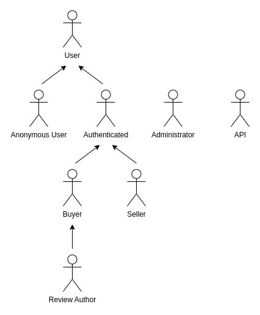
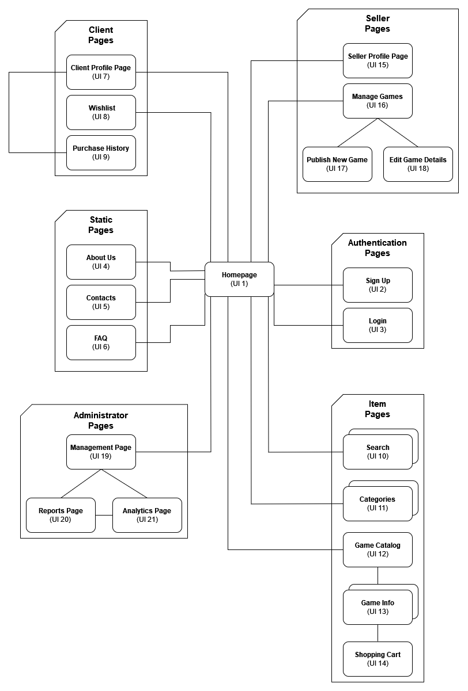
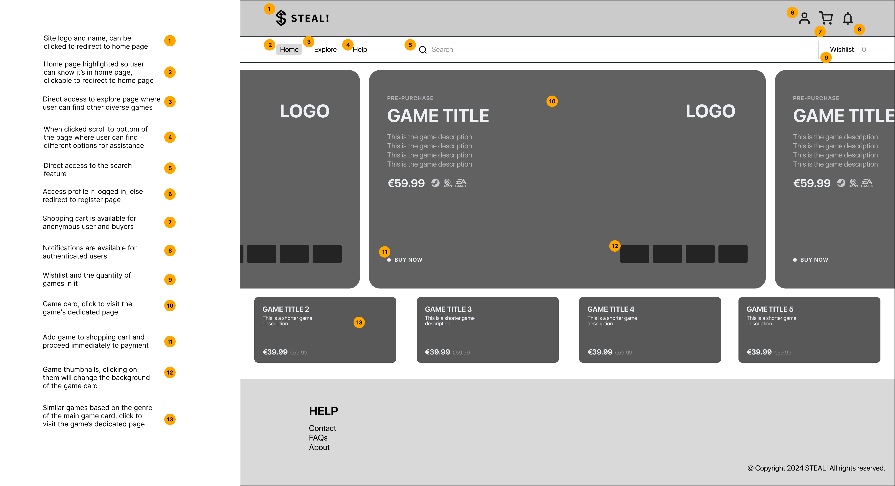
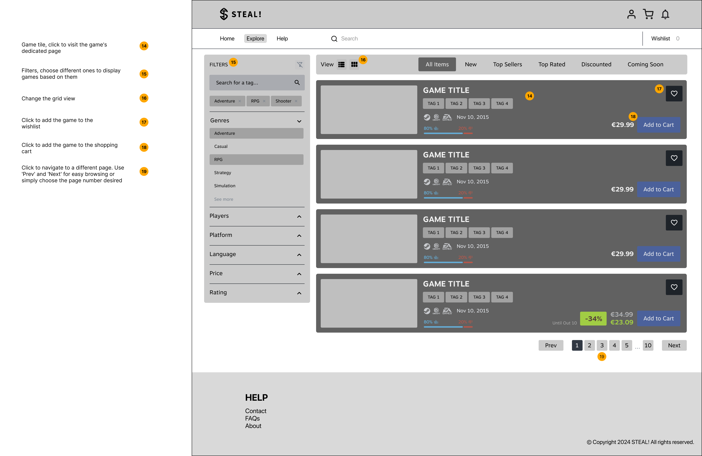
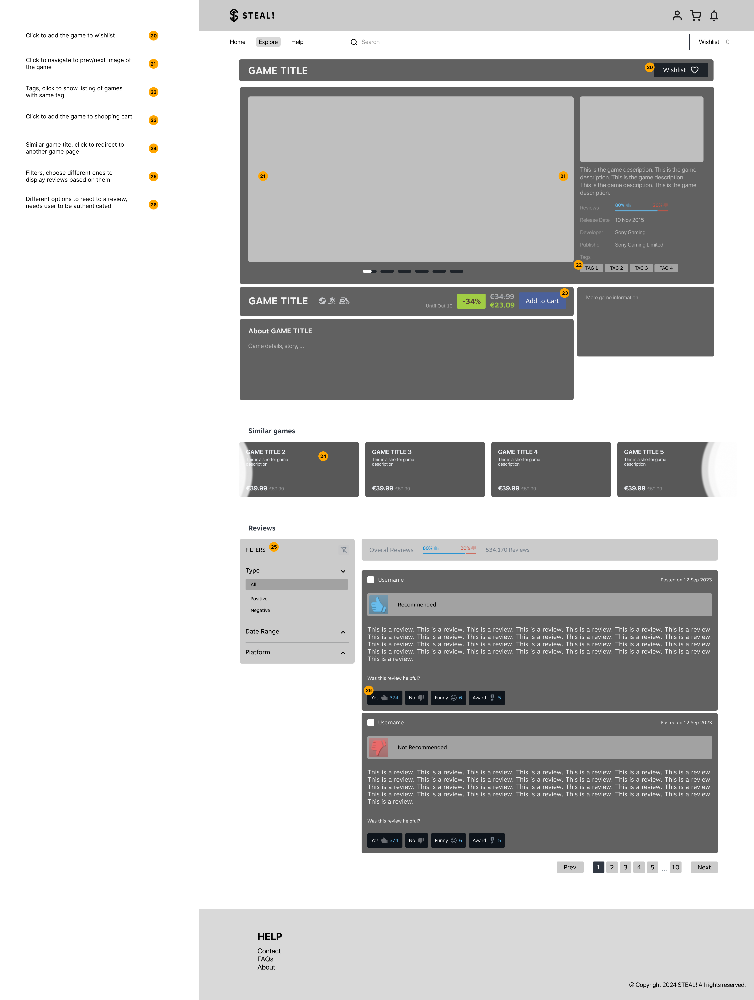

# ER: Requirements Specification Component

**Project Vision**

**STEAL!** is an online marketplace focused on selling Content Distribution Keys (CDKs). It offers a secure, user-friendly platform for gamers seeking affordable game keys, aiming to become the top destination for accessible, high-quality digital gaming.

> **"SO AFFORDABLE IT'S LIKE STEALING!"** 

----

## A1: STEAL!

### Goals, Business Context, and Environment

STEAL! aims to be a website where gamers can buy Content Distribution Keys (CDKs), which can be activated on game platforms like Steam, Uplay, Origin, and many others. Competing with other online gaming stores, STEAL! focuses on providing a smooth user experience, competitive prices, and a wide range of games for both casual and dedicated gamers.

### Motivation

The increased demand for video games has made STEAL! possible by providing affordable game keys in an easy and safe manner, attracting a wide range of gamers.

### Main Features

STEAL! provides advanced search and filtering options, making it easy for users to find their desired games. Users can conveniently manage their selections with a shopping cart and enjoy a customizable profile that tracks their purchase history and wishlist. It also offers personalized game recommendations based on users' preferences for those unsure of what to play next. Additionally, users can leave reviews for games they have purchased, helping others make informed decisions.

We have a dedicated staff team that actively manages the site and monitors user activity. If any suspicious behavior or inappropriate content is detected, whether in reviews or elsewhere, our team promptly takes action to ensure a safe and healthy gaming community. Additionally, we have a help section where users can send messages to the staff or administrators for assistance or to report concerns.

We have partnered with numerous game companies, allowing them to list their games directly on our platform, ensuring a wide and diverse selection for our users. Users can easily sign in with their site account or log in using their Google account for a seamless and efficient authentication experience.

Authenticated users with games in their wishlist will receive real-time notifications about discounts and special offers, ensuring they never miss a great deal. Our site also supports multiple currencies, enabling users from around the world to make purchases in their preferred currency for a more convenient shopping experience.

Recognizing that our users are the foundation of our success, we reward them with S coins that can be used as discounts on future game purchases. When users buy a game, they earn a percentage of their payment back in S coins. These coins can then be applied to reduce the price of their next purchase, enhancing their shopping experience and providing valuable savings.

Experience top-rated, minimalist design for effortless browsing and unbeatable deals, making your shopping journey as smooth as possible.

### User Profiles

STEAL! accommodates four distinct user profiles: 
- **Anonymous Users:** can browse products without registration, allowing them to explore the marketplace before deciding whether to create an account. 
- **Buyers:** are registered users who can browse products, purchase CDKs, and engage with the platform through wishlists and reviews. 
- **Sellers:** are users who list games for sale, manage their product information and pricing, and oversee order processing to ensure efficient transactions, but they cannot buy products on the platform.
- **Administrators:** have full control over the platform, managing product listings and user accounts to maintain smooth operations; however, they also cannot make purchases.

Together, these user profiles create a dynamic marketplace that fosters interaction and supports the gaming community.

---

## A2: Actors and User stories

> The following artifact contains the specifications about the actors and their user stories, acting as a guide and simple documentation for these project's requirements.

### 1. Actors

**Figure 1:** STEAL! actors.

| **Actor** | **Description** |
|-|-|
| Anonymous User | Users who can browse products without registration, allowing them to explore the marketplace, but can choose to authenticate whenever they wish. |
| User | Generic users who can access all publicly available information, such as listed CDKs. |
| Authenticated User | Registered users who have access to additional features of the platform. |
| Buyer | Registered users who can browse products, purchase CDKs, and create wishlists and engage with reviews. |
| Review Author | Users who have purchased CDKs and can leave reviews and ratings for those products. |
| Seller | Users who list games for sale and manage their product information and pricing. Cannot buy products. |
| Administrator | Users with full control over the platform, managing product listings, user accounts, and overseeing order processing. Cannot make purchases. |
| API | A system actor that allows external applications to interact with the platform programmatically, enabling functionalities such as retrieving product information, managing user accounts, and processing payments in several currencies. |

**Table 1:** STEAL! Actors description.

### 2. User Stories

> We have defined the following user stories to facilitate the workflow and clarify how the requirements will be implemented in our system.

#### 2.1. Anonymous User

| **Identifier** | **Name** | **Priority** | **Responsible** | **Description** |
|-|-|-|-|-|
| US01 | Browse Marketplace | High | Bruno Huang | As an Anonymous User, I want to browse the marketplace, view and filter the product list and categories, so that I can explore available CDKs. |
| US02 | View Product Details | High | Daniel Basílio | As an Anonymous User, I want to view detailed information about a game, including reviews, so that I can decide if I want to purchase it. |
| US03 | Register Account | High | Francisco Magalhães | As an Anonymous User, I want to register an account, so that I can access additional features. |
| US04 | Sign In Account | High | Francisco Magalhães | As an Anonymous User, I want to sign in to my account, so that I can have access additional features. |
| US05 | Add to Shopping Cart | High | Daniel Basílio | As an Anonymous User, I want to add games to a shopping cart, so that I can purchase multiple items at once. |
| US06 | Manage Shopping Cart | High | Daniel Basílio | As an Anonymous User, I want to manage my shopping cart, so that I can update quantities or remove items before purchasing. |
| US07 | Full Text Search | High | Ricardo Yang | As an Anonymous User, I want to perform full-text searches across the game catalog, so that I can quickly find games based on keywords. |
| US08 | Search Games by Genre/Platform | High | Daniel Basílio | As an Anonymous User, I want to search for games by genre, platform, price, language and rating, so that I can quickly find the games I am interested in. |
| US09 | Access Static Pages | Medium | Ricardo Yang | As an Anonymous User, I want to view static pages (About Us, Contact Us, Terms of Service), so that I can understand the platform’s purpose and policies. |

**Table 2:** Anonymous User user stories.

#### 2.2. Authenticated User

| **Identifier** | **Name** | **Priority** | **Responsible** | **Description** |
|-|-|-|-|-|
| US10 | Delete Own Account | High | Bruno Huang | As an Authenticated User, I want the option to delete my own account, so that I can control my personal data on the platform. |
| US11 | Edit Profile | High | Daniel Basílio | As an Authenticated User, I want to be able to edit my profile, so that I can personalize my account. |
| US12 | Log Out | High | Francisco Magalhães | As an Authenticated User, I want to log out of my account, so that my session is securely terminated and my account is protected. |
| US13 | View Profile | High | Francisco Magalhães | As an Authenticated User, I want to view my profile information, so that I can see my account details and ensure they are correct. |
| US14 | Update Profile Information | High | Francisco Magalhães | As an Authenticated User, I want to update my profile information, so that my account details are current. |
| US15 | Change Password | Medium | Francisco Magalhães | As an Authenticated User, I want to change my password, so that I can maintain the security of my account. |
| US16 | Contact Customer Support | Low | Ricardo Yang | As an Authenticated User, I want to be able to contact customer support, so that I can get help with any issues or questions I have. |
| US17 | View Activity History | Low | Francisco Magalhães | As an Authenticated User, I want to view my activity history, so that I can keep track of my interactions on the platform. |

**Table 3:** Authenticated User user stories.

#### 2.3. Buyer

| **Identifier** | **Name** | **Priority** | **Responsible** | **Description** |
|-|-|-|-|-|
| US18 | Checkout Items | High | Daniel Basílio | As a Buyer, I want to complete the checkout process for items in my cart or individual items, so that I can finalize my purchases efficiently. |
| US19 | Manage Wishlist | High | Daniel Basílio | As a Buyer, I want to manage my wishlist, so that I can keep track of desired games and purchase them in the future. |
| US20 | Add to Wishlist | High | Bruno Huang | As a Buyer, I want to add games to my wishlist, so that I can save them for future purchases. |
| US21 | Leave Reviews and Ratings| Medium | Bruno Huang | As a Buyer, I want to leave reviews and ratings for CDKs I have purchased, so that I can share my experience with other users. |
| US22 | Track Purchase History | Medium | Francisco Magalhães | As a Buyer, I want to track my purchase history, so that I can review my past orders. |
| US23 | Receive Payment and Order Notifications | Medium | Ricardo Yang | As a Buyer, I want to receive notifications about payment approvals and changes in order status, so that I am updated on my purchase progress. |
| US24 | Review Purchased Product | Medium | Francisco Magalhães | As a Buyer, I want to review products I have purchased, so that I can share my feedback with other users. |
| US25 | Edit or Remove Review | Medium | Ricardo Yang | As a Buyer, I want to edit or remove my reviews, so that I can update or delete feedback as necessary. |
| US26 | Cancel Order | Medium | Bruno Huang | As a Buyer, I want to cancel my order, so that I can manage my purchases effectively if I change my mind.|
| US27 | Report Inappropriate Reviews | Medium | Bruno Huang | As a Buyer, I want to report inappropriate reviews, so that I can help maintain a respectful and constructive community. |
| US28 | Receive Price Notifications | Medium | Ricardo Yang | As a Buyer, I want to receive notifications about promotions, and price changes on products either in shopping cart or in wishlist. |
| US29 | Multiple Payment Options | Low | Bruno Huang | As a Buyer, I want to complete my purchase using multiple payment methods as by PayPal, MBWay or credit card, so that I can choose the most convenient method for me. |
| US30 | Pay With S Coins | Low | Daniel Basílio | As a Buyer, I want to use **S coins** to pay for my purchases, either in full or partially, so that I can utilize the rewards I have earned in the store. |
| US31 | Receive Game Recommendations | Low | Ricardo Yang | As a Buyer, I want to receive game recommendations based on my search history and previous purchases, so that I can more easily find products that may be of my interest. |

**Table 4:** Buyer user stories.

#### 2.4. Seller

| **Identifier** | **Name** | **Priority** | **Responsible** | **Description** |
|-|-|-|-|-|
| US32 | List Games for Sale | High | Bruno Huang | As a Seller, I want to list games for sale, so that I can reach potential buyers. |
| US33 | Manage Product Listings | High | Daniel Basílio | As a Seller, I want to manage product listings and stock, so that the marketplace has accurate and relevant information. |
| US34 | Manage Product Information and Pricing | Medium | Ricardo Yang | As a Seller, I want to manage my product information and pricing, so that I can keep my listings up-to-date and competitive. |
| US35 | View Sales History | Medium | Ricardo Yang | As a Seller, I want to view my sales history, so that I can track my performance and earnings.|
| US36 | Receive Seller Notifications | Medium | Bruno Huang | As a Seller, I want to receive notifications about sales and buyer reviews, so that I can stay informed about my transactions and feedback. |
| US37 | Oversee Order Processing | Medium | Bruno Huang | As a Seller, I want to oversee order processing and manage order status, so that I can ensure smooth operations and address any issues promptly. |
| US38 | Manage Product Discounts | Low | Daniel Basílio | As a Seller, I want to manage product discounts, so that I can offer promotions and sales on CDKs. |

**Table 5:** Seller user stories.

#### 2.5. Administrator

| **Identifier** | **Name** | **Priority** | **Responsible** | **Description** |
|-|-|-|-|-|
| US39 | Administer User Accounts (Search, View, Edit, Create) | High | Bruno Huang | As an Administrator, I want to manage user accounts by searching for, viewing, editing, and creating user profiles, so that I can ensure that user information is accurate and up to date on the platform. |
| US40 | Block/Unblock or Delete User Accounts | Medium | Ricardo Yang | As an Administrator, I want to manage user accounts (either deleting, blocking/unblocking), so that I can maintain a secure and orderly platform. |
| US41 | Remove or Suspend Products | Medium | Bruno Huang | As an Administrator, I want to be able to suspend or remove and ban certain games from the system, so that I can ensure that all products available comply with our system's rules and guidelines. |
| US42 | Delete inappropriate reviews | Medium | Daniel Basílio | As an Administrator, I want to be able to delete inappropriate user reviews from the system, so that I can keep the interactions between the users respectful and polite. |
| US43 | Send Notification | Low | Francisco Magalhães | As an Administrator, I want to send notifications to users, so that I can communicate important information to buyers, sellers, or both. |
| US44 | Access to Sales Report | Low | Ricardo Yang | As an Administrator, I want to access sales reports for all games, so that I can analyze overall sales performance and trends. |

**Table 6:** Administrator user stories.

### 3. Supplementary Requirements

> This section contains business rules, technical requirements and other non-functional requirements on the project.

#### 3.1. Business rules

| **Identifier** | **Name** | **Description** |
|-|-|-|
| BR01 | Administrator Account | Administrators accounts are independent of the user accounts. (e.g. they can remove other users, they cannot buy nor sell products) |
| BR02 | Delete Account |  Upon account deletion, shared user data (e.g. reviews, likes) is kept but is made anonymous.|
| BR03 | Deleted Item History |  The history of an item must be maintained, even if the item is deleted, to preserve the sales record for all items. |
| BR04 | Purchase Confirmation | Buyers must confirm their purchase before payment is processed. After confirmation, no changes or cancellations can be made. |
| BR05 | Price Changes | Sellers can modify the price of listed games, but buyers who already made a purchase will not be affected by the price change. |
| BR06 | Key Delivery | After payment is confirmed, the CDK is delivered instantly via the buyer's email. |
| BR07 | Stock Availability | Buyers can only purchase a CDK if it is in stock. Out-of-stock items cannot be added to the cart or purchased; however, they can be added to the wishlist and be notified when in stock. |
| BR08 | Wishlist and Cart Removal | If a game is deleted from the store, it is automatically removed from all users' wishlists and shopping carts. |
| BR09 | Date Validation | For any date entries (e.g., exit date), the exit date must be greater than or equal to the entry date. |
| BR10 | Seller Interaction Restrictions | Sellers cannot vote or review their own products to ensure unbiased interactions on the platform. |
| BR11 | Purchase-Based Reviews | Buyers can only review products they have purchased, ensuring reviews are based on actual experience. |

**Table 7:** STEAL! business rules.

#### 3.2. Technical requirements

| **Identifier** | **Name** | **Description** |
|-|-|-|
| TR01 | Response Time | The system should have response times shorter than 2 seconds to ensure user engagement. (Performance)    Fast response times are critical for user retention and satisfaction. If the system is slow, users may abandon their carts or leave the site entirely, resulting in lost revenue. A responsive and smooth experience encourages users to explore the platform and complete purchases. |
| TR02 | Error Handling | The system must be prepared to handle and continue operating when runtime errors occur. (Robustness) |
| TR03 | Scalability | The system must be prepared to deal with the growth in the number of users and their actions. (Scalability) |
| TR04 | Accessibility | The system must ensure that everyone can access the pages, regardless of disabilities or the web browser they use. (Accessibility) |
| **TR05** | **User Review System** | **The system must include a feature for users to leave reviews and ratings for purchased CDKs.    User reviews build trust and provide valuable feedback, helping potential buyers make informed decisions and improving the overall credibility of our platform.** |
| TR06 | Multi-Payment Support | The system must facilitate integration with multiple payment gateways, allowing users to select their preferred payment method. (Functionality) |
| **TR07** | **Instant CDK Delivery** | **Upon successful payment, the system must deliver the CDK immediately via the buyer's email. (Usability)** |
| TR08 | User-Friendly Interface | The system should feature an intuitive user interface that allows users to navigate easily, search for CDKs, and manage their accounts. (Usability) |
| TR09 | Database | The PostgreSQL database management system must be used, with a version of 11 or higher. |
| **TR10** | **Real-Time Inventory Updates** | **The system must update inventory levels in real-time to prevent overselling and ensure accurate stock information.    Real-time updates help maintain trust with users by ensuring they can only purchase items that are actually in stock, reducing the likelihood of customer dissatisfaction.** |

**Table 8:** STEAL! technical requirements.

#### 3.3. Restrictions

| **Identifier** | **Name** | **Description** |
|-|-|-|
| C01 | Game Age Restriction | Users must be at least the age specified by the game’s age rating (e.g., ESRB, PEGI) to make purchases for that game. |
| C02 | Bot Restriction | Users must successfully complete a Captcha verification to ensure that purchases are made by humans and not automated bots. |

**Table 9:** STEAL! project restrictions.

---

## A3: Information Architecture

> The following artifact provides a brief overview of the system's architecture. This overview facilitates a more in-depth identification and description of user requirements, as well as the methodical planning of the system's interface.

This artifact includes two key elements:

- 1. Sitemap – This element presents a brief and concise organization of the system's interface.
- 2. Wireframes – These elements provide a simple overview of selected system interface pages. They help define functionality and describe content placement and organization. A minimum of two wireframes will be included in this section.

### 1. Sitemap

A sitemap is a visual representation of the relationships between the pages within a system's interface, illustrating how information is organized and connected. It identifies all unique pages in the system and shows how they are structured and related to each other.

The STEAL! system is divided into six main page types:

- **Static pages:** Provide general information about the system.
- **Authentication pages:** Allow unauthenticated users to create an account or log in.
- **Item pages:** Accessible by all users to view details and interact with CDKs (codes or products) available in the system.
- **Client pages:** Reserved for buyers (client users), enabling actions related to purchasing.
- **Seller pages:** Exclusively for sellers to list, manage, and sell CDKs.
- **Admin pages:** Reserved for system administrators to manage user accounts, product listings, and handle user reports or complaints.

In the following sitemap, all pages in STEAL!'s interface are displayed as small rounded boxes and grouped by their type (e.g., static, authentication, client). Black lines represent direct navigational paths between pages. Some pages with the exact same functionality and organization that can have different instances per user such as the game info pages are represented by a stack of pages.

**Figure 2:** STEAL! sitemap.

### 2. Wireframes

Wireframes are used to describe layout ideas, content, and the overall page-level design. A page wireframe defines how space is allocated and how content is prioritized, including which features are available.

> The wireframes for the home page (UI1), game catalog page (UI12) and the game info page (UI13) are presented in Figures 3, 4 and 5, respectively.

#### UI1: Homepage

**Figure 3:** Homepage (UI1) wireframe.

#### UI12: Game Catalog

**Figure 4:** Game catalog page (UI12) wireframe.

#### UI13: Game Info

**Figure 5:** Game info page (UI13) wireframe.

---

## Revision history

Changes made to the first submission:
1. A1 Main Features: Expanded explanations of some mandatory project features and a clearer overview of the S coins system.
2. A2 Actors: Added a Review Author in actors, it ensures that only verified buyers who have purchased the game can leave a review.
3. A2 User Stories: Refined some user stories to incorporate some missing mandatory features.
4. A2 Business Rules: Added a business rule (BR11) that restricts buyers to reviewing only products they have purchased, ensuring reviews reflect genuine user experiences.

***
GROUP2435, 04/10/2024

* Bruno Huang, up202207517@up.pt (Editor)
* Daniel Basílio, up201806838@up.pt
* Francisco Magalhães, up202007945@up.pt
* Ricardo Yang, up202208465@up.pt
